*Version 0.3*

# Abstract

This paper offers a portable engineering discipline for reasoning about reliability when agentic AI is introduced into sociotechnical systems.

It is not a formal proof. It is a compact design language of axioms, statements, and tests, meant for an engineering team to pick up and use to separate claims that are routinely conflated: reliability, quality, time, cost, and capability.

The approach is Parrish's: *learn from what others have already learned.* Reliability has been studied for decades in industrial engineering; layered systems were named by Brand for buildings and rediscovered elsewhere by many others; the idea of complexity as evolution comes from Gall; thinking across multiple criteria, and the distinction between slow and fast variables, comes from the broader systems thinking literature Parrish synthesizes. This paper imports those results into agentic AI rather than rediscovering them under new labels.

The intellectual anchors are Garrett Hardin [1] (reliability as a multiplicative property of systems where humans and technology must both succeed), John Gall [2] (complex working systems evolve from simple working ones), Stewart Brand [3] (systems are layered, and the layers run at different speeds), and Shane Parrish [4] (slow versus fast variables, second order effects, leverage points).

The central question:

> When we add agentic AI to a system where humans and technology must both succeed, do we make the system more reliable, or do we merely make it faster, cheaper, more capable, or higher quality while adding new failure modes?

The working conclusion: agentic AI should not be treated as a reliability improvement by default. It earns reliability credit only when the failures it prevents and the exposure it reduces exceed the dependency cost, coordination cost, and new failure categories it introduces, and only when its authority is enforced by the tool layer rather than left to the agent.

The intent is reusability. The discipline below should fit on a wall, survive a project review, and remain interpretable to an engineer who has not read this paper before.

> *An individual understands a concept, skill, theory or domain of knowledge to the extent that he or she can apply it appropriately in a new situation.*
>
> Howard Gardner, quoted in Parrish [4].

This paper assumes that test. The discipline below is meant to be applied to systems you have not yet seen.

# 1. Purpose: a reusable design discipline

This paper develops a portable, reusable way to reason about system reliability when agentic AI enters a sociotechnical system.

The aim is not mathematical completeness. The aim is a compact design language an engineering team can adopt as a working discipline, applied across products, projects, and review boards, to separate questions that are routinely mixed together:

- Is the system more reliable?
- Is the output higher quality?
- Is the work done faster?
- Is the operation cheaper?
- Is the system more capable?
- Are new categories of failure introduced?
- Are those new failures acceptable?
- Is the agent's authority enforced from outside it, or left to the agent itself?

The first discipline is to refuse to call all improvement "reliability improvement". A system may become faster without becoming more reliable. It may become more capable while becoming less predictable. It may produce better results while increasing the chance of a dangerous failure. Those are different claims, and each must be evaluated on its own evidence.

The second discipline, harder than the first: assume the agent is not the place where reliability lives. The agent is a fast layer. Reliability lives in the slow layer underneath, and someone, on purpose, has to keep building that layer.

The third discipline, easiest to forget: prior art exists. Industrial reliability engineering, security architecture, civil engineering, and the systems thinking literature have already worked through most of what agentic AI now encounters again. The work of this paper is to import what is already known, name where each piece comes from, and adapt it to the agentic case, not to invent reliability afresh because the actor is now a model.

# 2. Starting point: Hardin's reliability relation

Garrett Hardin [1] sets out a simple multiplicative relation for reasoning about systems where humans and technology must both succeed for the system to succeed:

$$
SR = HR \cdot TR
$$

Where:

| Symbol | Meaning |
|---|---|
| $SR$ | system reliability |
| $HR$ | human reliability |
| $TR$ | technological reliability |

The important property is that reliability is represented as a value between zero and one:

$$
0 \leq R \leq 1
$$

A reliability of $1$ would mean perfect reliability. In real systems, this is not normally available.

For example:

$$
HR = 0.60
$$

$$
TR = 0.95
$$

Then:

$$
SR = 0.60 \cdot 0.95 = 0.57
$$

This is already uncomfortable. A highly reliable technical system does not automatically produce a highly reliable total system. The human and technical parts are coupled. If both are required, both matter.

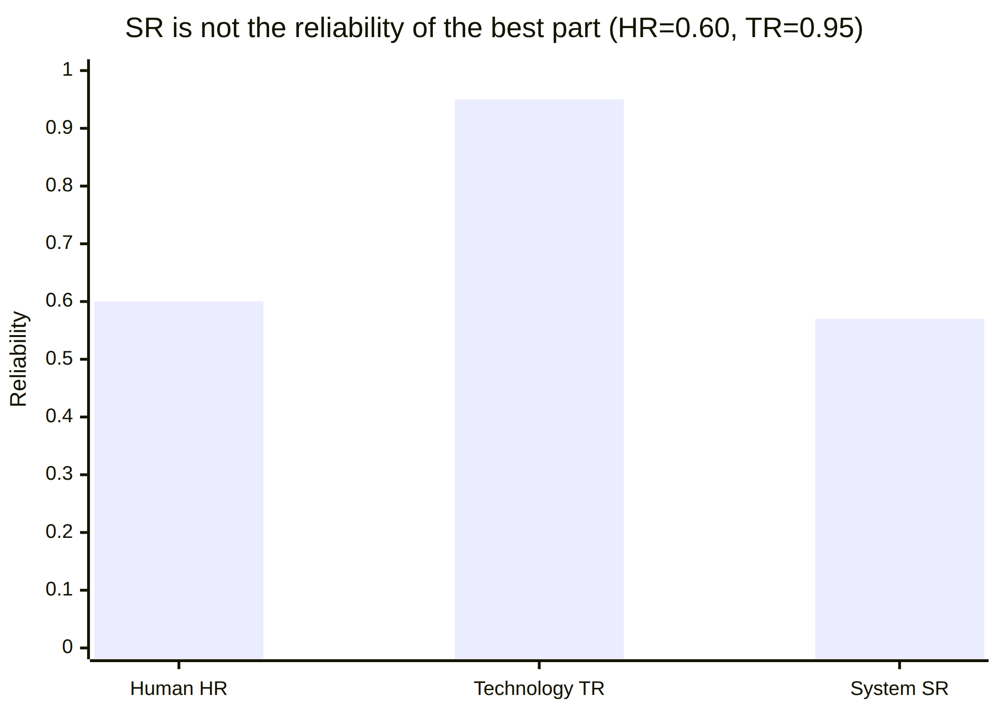{ width=75% }

*Figure 1. The multiplicative coupling of Statement 1. The system (0.57) lands below both of its required factors, not between them. A strong technical part cannot lift the product above the weak human part.*

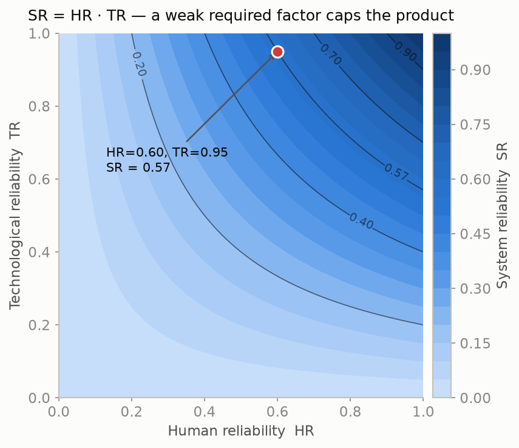{ width=62% }

*Figure 2. The full response surface behind Figure 1. Colour is $SR = HR \cdot TR$ over every combination of the two required factors; the curved lines are contours of constant $SR$, and the 0.57 contour runs through the worked point (0.60, 0.95). The shape is the whole point: raising the strong factor slides you along a contour, not up it — only lifting the weaker factor moves $SR$ upward.*

Hardin's framing predates agentic AI by decades and was developed for systems where humans and technology jointly determined an outcome. The relation is the cleanest two factor decomposition for systems with both human and technical elements, and it has held up across decades of industrial reliability practice. Importing it here costs nothing; rebuilding it would cost everything.

## Statement 1

> System reliability is not the reliability of the best part. It is the reliability of the required combination.

## 2.1 Hardin's filters: infrastructure, data, and transactions

Hardin [1] is used here as a practical design lens, not as a scientific law. The literate filter asks whether words and abstractions clarify or hide reality. The numerate filter asks whether quantities, ratios, rates, and limits have been considered. The ecolate filter asks what follows in the wider system, since interventions rarely do only one thing.

In this framing, energy and matter are treated as the physical substrate of action. In human systems, they appear as infrastructure: bodies, tools, machines, networks, buildings, power systems, devices, and materials. Information is different. It is interpretive and context-dependent. Organizations do not use information in pure form; they use data, which is information encoded into operational structures.

This encoding is similar to an analog-to-digital conversion. A richer reality is sampled, selected, named, categorized, and structured so that systems can act on it. This makes information usable, but it also reduces it. Context, nuance, ambiguity, intent, timing, and tacit knowledge may be lost. The same simplification dynamic at the level of states and institutions is the subject of Scott [5]. Over time, data can also decay: it becomes stale, detached from its original context, copied without interpretation, or read through assumptions that no longer hold. In that practical sense, organizations face an informational entropy problem.

Transactions are the reason systems are needed. A transaction is a moment where something is exchanged, moved, transformed, authorized, committed, produced, settled, or made accountable. Transactions are where infrastructure and organization meet. Infrastructure makes action physically executable; organization makes information usable through representation, validation, coordination, and governance.

The same intended outcome may require more transactions when information is unclear, incomplete, untrusted, stale, or poorly encoded as data. Misunderstanding creates clarification transactions. Weak validation creates correction transactions. Governance creates approval and audit transactions. Coordination failure creates rework transactions. This can be treated as transactional multiplication.

As a design principle, systems should reduce harmful transactional multiplication while preserving the transactions needed for validation, coordination, governance, memory, safety, and accountability. The relation $SR = HR \cdot TR$ is one narrow expression of this larger framing: it asks how reliably a system can carry a transaction once both humans and technology are required for completion.

# 3. Reliability layers: a view inspired by Brand and Parrish

Before multiplying reliability factors, we should ask where those factors live.

A system is not flat. It is layered.

Stewart Brand [3] introduced the shearing layer view: a building is composed of layers that change at different speeds, namely site, structure, skin, services, space plan, and stuff. Slow layers absorb shocks generated by fast ones; the building survives because the layering holds. Brand's claim is empirical, drawn from decades of observing what happens when fast layers are allowed to corrupt slow ones.

Shane Parrish [4] generalises the same pattern across domains: in any working system, *slow variables* set the conditions and *fast variables* react. Reliability accumulates in slow variables. Capability and feature work happens in fast ones. A system whose fast variables can quietly rewrite its slow variables has lost its layering, regardless of what the architecture diagram still claims.

The layered property is not new. It was already visible in operating systems (kernel vs. application), in networking (transport vs. application), and in civil engineering (foundation vs. interior). Brand and Parrish are useful here because they have named the property cleanly. Naming it once, with these two authors as the explicit anchors, lets the rest of this paper apply it without deriving it again.

The same applies to sociotechnical and agentic AI systems.

We can think in reliability layers:

| Layer | Building analogy | Reliability meaning |
|---|---|---|
| Purpose and constraints | Site | Why the system exists; what must not casually change |
| Governance and accountability | Structure | Who is responsible; what authority exists |
| Process and operating model | Space plan | How work flows between people, tools, and agents |
| Technical platform | Services | Infrastructure, APIs, identity, data, runtime |
| Agentic behavior | Stuff (fast layer) | Prompts, tools, plans, model behavior, task execution |
| Outputs and interactions | Fast surface layer | Produced artifacts, recommendations, and actions |

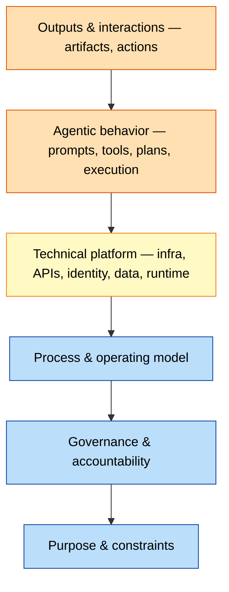{ width=40% }

*Figure 3. The shearing layers of §3, fast (orange, top) resting on slow (blue, bottom). Each layer rests on the one beneath it. Axiom 1 is the rule that arrows may carry adaptation downward but never let a fast layer rewrite a slow one.*

## Axiom 1: Fast layers must not destabilize slow layers

A fast layer may improve adaptability, but it must not corrupt, bypass, or silently redefine slower layers that provide stability.

In agentic AI terms:

$$
\text{Agent behavior must not redefine governance, accountability, or system purpose.}
$$

Agentic behavior naturally belongs in faster layers: drafting, checking, orchestration, recommendation, summarization, triage, and bounded task execution.

Governance, authority, identity, auditability, and business constraints belong to slower layers.

## Statement 2

> Agentic AI is safest when introduced first in reversible, observable, bounded, fast layers.

# 4. When the layers fuse: model, data, infrastructure

The layered view from §3 still applies around an agentic system. Governance, identity, and business constraints stay slow. Configurations, prompts, and plans stay fast. The slow layers absorb shocks; the fast layers innovate.

What it does not cleanly capture is the AI itself.

The "Agentic behavior" row in §3's table is shorthand. In practice, a single act of inference is a fusion of three things that Brand would put on different layers: the **model** is a slow asset, retrained on long cycles, expensive to change. The **data** is slow when treated as a corpus, slow when treated as a feature store, fast when treated as runtime context. The **infrastructure** that runs the model is a slow platform asset. At inference time, all three behave as one thing. They produce the agent's output together, and the failure of any one of them shows up on the surface as if the agent failed.

Wendt [6] names this directly: the AI is a fusion of model, data, and infrastructure, and the reliability of an agentic system therefore depends on data provenance, versioning, traceability, and auditability across all three.

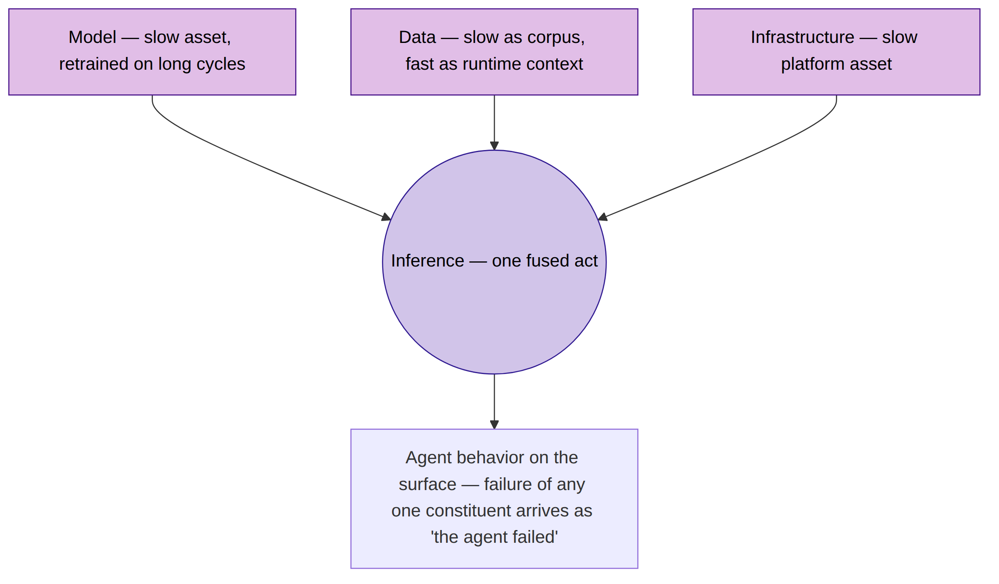{ width=62% }

*Figure 4. The dependency triangle of §4. Three things Brand would place on different layers fire together at inference time. Their reliability cannot be decomposed and re-multiplied; the fusion is what is reliable or not, and it has to be observed where it arrives.*

This has consequences for the rest of this paper.

The reliability of the AI component cannot be cleanly decomposed. "The model is reliable, the data is reliable, the infrastructure is reliable, therefore the agent is reliable" is not a valid step. The fusion is what is reliable or not; its constituents are necessary but not sufficient.

Layer-weighted reliability, developed in §15, still applies to the boundaries around the AI. Governance, identity, audit, and data integrity keep their consequence weights and stay on the slow layer where they belong. Inside the AI, the weights collapse onto the fusion. The engineer cannot weight the model differently from the data it ran against, in the moment it ran.

Maintenance acts on the constituents. The model is retrained. The data is refreshed, versioned, and provenance-checked. The infrastructure is patched and scaled. But the system has to be *observed* at the fusion, because that is where the agent's behavior actually arrives.

The paper continues to use layered thinking as a discipline because the boundaries around the AI still benefit from it. It accepts that one of the boxes in §3's table is not a layer at all. It is a small dependency triangle that fires together.

The fusion has an adversarial counterpart. Brodt et al. [7] document how attacker introduced state crosses what the layered view treats as separate layers: a payload deposited in agent memory or in a retrieval store during one inference is fetched back into a later inference, behaviour at the fast layer is rewritten by content fetched at the fast layer that should have lived as policy in a slower one, and a single compromised agent propagates laterally to others through shared substrates. Where §4 loosens Brand's layering spatially, the kill chain loosens it temporally and adversarially. The mechanisms that the engineer relied on to separate slow and fast (memory, retrieval, tools) are the same mechanisms an attacker uses to migrate state across the boundaries.

## Statement 3

> The AI itself is a fusion of model, data, and infrastructure. Layered reasoning still applies to what surrounds it; inside it, the layers run together and have to be observed as one.

# 5. Required components multiply

If several components, steps, or actors are all required to work, then modeled reliability is multiplicative:

$$
SR = \prod_{i=1}^{n} R_i
$$

Where:

| Symbol | Meaning |
|---|---|
| $R_i$ | reliability of required component or step $i$ |
| $n$ | number of required components or steps |
| $SR$ | modeled system reliability |

Because every reliability factor satisfies:

$$
0 \leq R_i \leq 1
$$

adding one more required factor gives:

$$
SR_{new} = SR_{old} \cdot R_{n+1}
$$

Since:

$$
R_{n+1} \leq 1
$$

then:

$$
SR_{new} \leq SR_{old}
$$

unless:

$$
R_{n+1}=1
$$

That is the uncomfortable but useful part.

The form is honest only when the $R_i$ are genuinely distinct. They often are not. As Leech et al. [8] note, ML failures may be correlated because different models can fail on the same adversarial examples, and several agentic factors may share an underlying model, share training data, or share a common context-window blind spot.

A worked example. A pipeline lists two agentic steps in series, each at $0.97$. If the steps were genuinely independent, the multiplicative form would give $0.97 \cdot 0.97 = 0.9409$. But suppose both steps invoke the same underlying model, or share training data, or are vulnerable to the same kind of adversarial input. The two steps do not fail as a chain, where one knocks the other down. They fail because the same underlying fault, when triggered, takes both of them out at once. In that case the two steps are not two factors at $0.97$ each. They are one factor at $0.97$, listed twice. The system reliability stays at $0.97$. The multiplicative form was honest only when the factors counted in it were genuinely distinct; counting the same substrate twice does not introduce diversity into the chain, and the reliability the form promised was never there.

The same observation cuts harder for redundancy, which is where engineers usually reach for the multiplicative dividend. A backup agent added to improve reliability does not multiply failure probability down if it shares its model or training data with the primary. The backup fails when the primary fails, on the same adversarial input or the same blind spot. Redundancy without diversity is not redundancy. It is the same fault, given two opportunities to be triggered.

The §5 worked example is the technological-axis arithmetic going honestly wrong because a second axis was hidden behind the same numbers. §6 develops this generalisation explicitly.

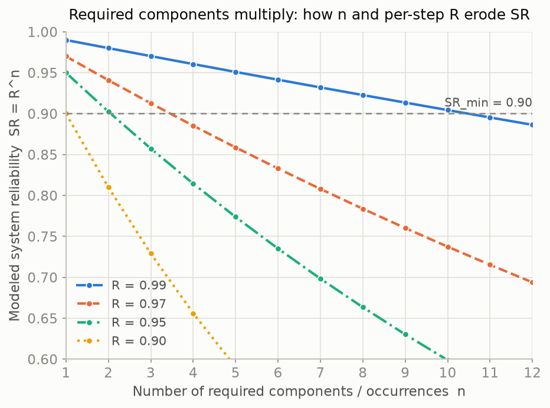{ width=80% }

*Figure 5. How the product $SR=\prod_{i=1}^{n} R_i$ behaves when $n$ identical required components each have reliability $R$. Each curve fixes one value of $R$; the dashed line is an illustrative floor $SR_{min}=0.90$. Components that look reliable in isolation still fall through the floor as occurrences accumulate — even $R=0.97$ crosses it by the fourth required step. This is the visual form of Axiom 2: every required dependency weakly reduces reliability, and the reduction compounds.*

## Axiom 2: Required dependency is reliability debt

Every additional required dependency weakly reduces modeled reliability unless it is perfect.

Since perfect dependencies are not normally available, every new required dependency must justify itself.

## Statement 4

> Complexity is not free. Even reliable components reduce total reliability when they become required dependencies.

# 6. Reliability is not a scalar

A reliability number on its own is a scalar. Traditional engineering can use it because the components and their failure modes are decomposable: each $R_i$ in the multiplicative form describes a distinct failure path, and the product is honest because the paths really are distinct. The §5 worked example shows where this assumption breaks for agentic AI: two steps that share an underlying model are not two factors at $0.97$ each. They are one factor at $0.97$, listed twice.

This is not a special case. It is a general property of fused-substrate systems, and it forces a generalisation of the reliability concept itself.

## The analogy from electrical engineering

Electrical impedance is the classical example of why one dimension is sometimes not enough. In direct-current circuits, impedance is just resistance: $Z = R$, a real number. In alternating-current circuits, impedance gains a second dimension:

$$
Z = R + i X
$$

where $R$ is resistance and $X$ is reactance, the dimension that captures phase, energy storage, and time-dependent behaviour. The DC case is the AC case with $X = 0$. AC is not less real than DC; it is the more general regime, and DC is the special case where the second axis happens to be zero.

The same generalisation applies to reliability.

## Two axes

Reliability has two axes:

$$
\mathcal{R} = R_t + i R_c
$$

Where:
- $R_t \in [0,1]$ is *technological reliability*: the probability of no technological failure under the failure modes the paper has been modelling so far.
- $R_c \in [0,1]$ is *coherence reliability*: the probability that the system behaves consistently with its intent across the fused substrate that produces its behaviour.

The complex form is a notational convenience. The two axes carry different kinds of risk and compose by different rules; they are not added or multiplied as scalars. Writing them as $R_t + i R_c$ makes the orthogonality visible.

For traditional decomposable systems, $R_c = 1$. The components are distinct, the failure modes are independent, and there is no shared substrate that could co-fail. The scalar form $\mathcal{R} = R_t$ recovers the entire model, exactly as DC recovers all of $Z$ when reactance is zero.

For agentic AI, $R_c < 1$ in general. The model, the data, and the infrastructure (§4) fuse at inference time; what looks like distinct steps may share a substrate; what looks like multiple decisions may be one underlying behaviour repeated. The scalar form is no longer enough. Reliability is two-dimensional.

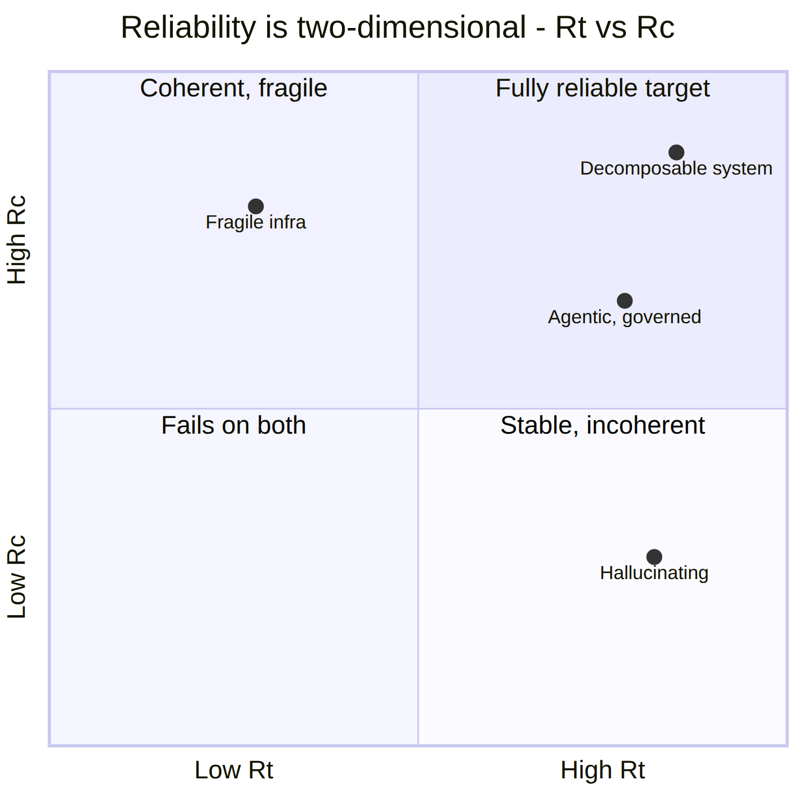{ width=62% }

*Figure 6. The two axes of Statement 5. Traditional engineering lives on the top edge where $R_c = 1$ and the scalar model is exact. Agentic systems drop off that edge; a high-$R_t$ system that hallucinates (bottom-right) and a coherent system on fragile infrastructure (top-left) are different failures, and reporting only $R_t$ hides one of them.*

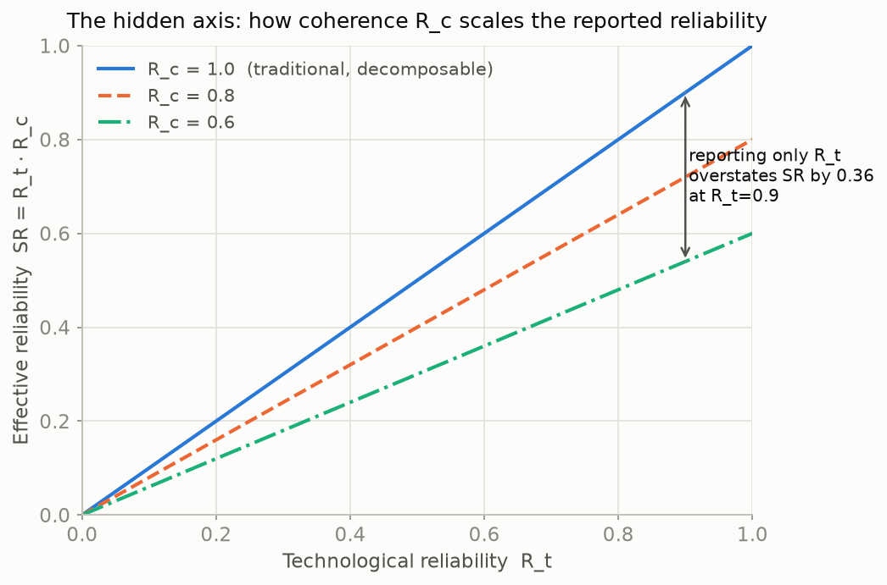{ width=80% }

*Figure 7. The multiplicative cost of the coherence axis, drawn as the product $R_t \cdot R_c$. Each line fixes $R_c$ and sweeps $R_t$. Traditional decomposable systems ride the top line ($R_c = 1$); as coherence falls, the whole line pivots down. A system reported at $R_t = 0.9$ actually delivers $0.54$ once $R_c = 0.6$ — the vertical gap between the lines is exactly the amount by which reporting only the technological axis overstates $SR$.*

## Composition rules

The two axes do not compose the same way.

**Technological reliability composes multiplicatively** in series, when the factors are genuinely distinct:

$$
R_t^{system} = \prod_{i=1}^{n} R_t^{(i)}
$$

This is the model already developed in §5.

**Coherence reliability does not compose multiplicatively.** The coherence of a system bounded by a shared substrate is bounded above by the coherence of the substrate itself. Listing two steps that share the substrate does not multiply the coherence dimension; it counts the same coherence factor twice. In the worst case:

$$
R_c^{system} = \min_{i} R_c^{(i)}
$$

across the components that share the substrate. Coherence is not a chain of independent links. It is a property of the fusion. Adding more steps that share the same model does not add coherence; it just gives the same coherence factor more opportunities to be visible.

## Effective system reliability

When both dimensions matter, the system succeeds only when both succeed:

$$
SR = R_t \cdot R_c
$$

A system can have high $R_t$ and low $R_c$: the model rarely crashes but produces semantically inconsistent or hallucinated outputs. A system can have high $R_c$ and low $R_t$: coherent in what it produces, but operationally fragile. Either failure mode is sufficient to bring $SR$ down. The scalar reliability is the product, but the two factors are independent claims, and an engineer who reports only one of them is reporting only half the system.

## Why this matters for the rest of the paper

Every reliability claim in this paper has been a $R_t$ claim. The multiplicative form, the failure categories of §12, the conservation of failure space in §13, the time-exposure model in §19, the outcome vector in §21 — all are technological. The coherence dimension lives alongside them. Where the existing math applies, it applies to $R_t$; where the system has $R_c < 1$, the engineer has to account for it separately, and cannot recover it by multiplying more $R_t$ factors.

## Statement 5

> Reliability is not a scalar in $[0,1]$. It is a two-dimensional object: a technological axis $R_t$ (the math this paper has been writing) and a coherence axis $R_c$ (the shared substrate that produces the behaviour). Traditional decomposable engineering has $R_c = 1$ and can ignore the second axis. Agentic AI does not, and reliability claims that report only the technological axis are reporting half the system.

# 7. Repeated factors: counting occurrences

Systems often contain multiple occurrences of the same kind of reliability factor.

Examples:

- several human judgments;
- several technical operations;
- several agentic actions;
- several API calls;
- several handoffs;
- several review points.

So we can write:

$$
SR = H^h \cdot T^t \cdot A^a \cdot C^c
$$

Where:

| Symbol | Meaning |
|---|---|
| $H$ | reliability of one step that depends on a human |
| $T$ | reliability of one step that depends on technology |
| $A$ | reliability of one step that depends on agentic AI |
| $C$ | reliability of one coordination, control, or handoff step |
| $h,t,a,c$ | number of required occurrences |

This makes repeated exposure visible.

A single agentic action with reliability $0.97$ may look good. But five required agentic actions give:

$$
0.97^5 \approx 0.8587
$$

That is a different system.

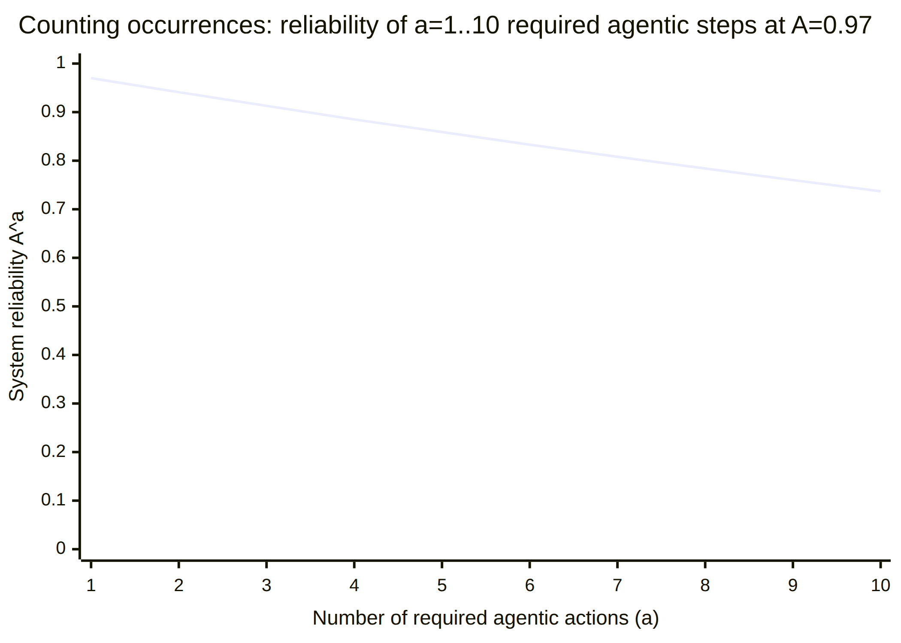{ width=75% }

*Figure 8. Statement 6 made visible. A single step at 0.97 looks reliable; the curve is what "count occurrences, not component types" means. Five required actions already sit at ~0.86, ten below 0.74 — each added exposure is a multiplication, not an addition.*

## Statement 6

> Count occurrences, not only component types.

## Worked example: counting occurrences

A document processing pipeline requires:

- 5 agentic steps, each at $A=0.97$
- 3 coordination handoffs, each at $C=0.99$
- 2 required human reviews, each at $H=0.95$
- 4 required technical operations, each at $T=0.999$

Then:

$$
SR = H^2 \cdot T^4 \cdot A^5 \cdot C^3
$$

$$
SR = 0.95^2 \cdot 0.999^4 \cdot 0.97^5 \cdot 0.99^3
$$

$$
SR \approx 0.9025 \cdot 0.9960 \cdot 0.8587 \cdot 0.9703 \approx 0.7497
$$

Each component looks reliable. The system lands at roughly 75 percent modeled reliability. The discipline is to make this calculation visible before the system ships, not after.

# 8. First approach: the transfer model

It is tempting to model agentic support as if reliability could be transferred between components: the agent reduces the human's burden, so the human's effective reliability rises. A first version of this idea is:

$$
S(x)=(H+x)\cdot T
$$

Agentic support adds an amount $x$ to human reliability; technology reliability is unchanged. The intuition is right in direction. The model is still missing the agent itself.

The agent is now a required component, with its own reliability $A$. Once the agent is in the system, the technology side is not $T$ alone but $T\cdot A$:

$$
S(x)=(H+x)\cdot (T\cdot A)
$$

Since $A\in[0,1]$ and is rarely $1$, the new technology side is strictly smaller than the old:

$$
T_{new}=T\cdot A<T_{old}
$$

So the lift on the human side has to overcome a loss on the technology side just to break even. Human reliability is rising; system reliability is not necessarily following.

This is closer to the truth, but still not enough. The model assumes the agent contributes only one more multiplicative factor. Agentic AI does more than that. It changes:

- work allocation;
- decision load;
- action authority;
- monitoring burden;
- failure exposure;
- review capacity;
- control structure.

When the agent enters the system, the human is not the only factor whose reliability shifts, and the agent is not the only new factor. The coordination and handoff between human and agent is another new component, with its own reliability $C$. The structure of the work has changed.

So $x$ should not mean "reliability added to one specific factor".

A better definition is:

$$
x = \text{degree of delegation, automation, or agentic support}
$$

Then human reliability becomes:

$$
H(x)
$$

a function of the delegation level, which may go up, down, or stay the same as automation enters. The $H(x)$ form does not commit to a sign in advance; it commits to measurement. The naive shorthand:

$$
H+x
$$

skips that measurement and assumes the answer.

## Statement 7

> Agentic AI changes the structure of work and control. It does not simply transfer reliability from one component to another.

# 9. Introducing agentic AI

Agentic AI introduces at least two new reliability factors:

$$
A = \text{agent reliability}
$$

$$
C = \text{coordination and control reliability}
$$

So a basic agentic system model becomes:

$$
SR_{agentic}=H(x)^h \cdot T(x)^t \cdot A(x)^a \cdot C(x)^c
$$

This is better than the transfer model in §8 because it shows that the agent is not merely improving the existing system. It is also becoming part of the system, with its own reliability factor and its own coordination cost.

The agentic layer may help. But it must also work.

The handoff layer may help. But it must also work.

The monitoring layer may help. But it must also work.

This is where the cognitive beef begins.

# 10. Agentic AI may produce reliability gain

If agentic AI only added dependencies, the reliability case would usually be weak.

But agentic AI may also reduce failures by:

- checking work;
- detecting mistakes;
- reducing cognitive burden;
- preventing missed steps;
- enforcing consistency;
- producing alternative reasoning;
- improving observability;
- supporting recovery;
- shortening the time window in which failure can occur.

So we need a gain term.

Let:

$$
G(x)=\text{validated reliability gain from agentic support}
$$

The word "validated" matters. A claimed improvement is not the same as an observed reduction in failure.

## Statement 8

> Agentic AI earns reliability credit only for validated failure reduction, not for theoretical capability.

# 11. Failure probability is often clearer

Instead of modeling reliability directly, it is often easier to model failure.

Let:

$$
F = 1 - SR
$$

The baseline failure probability is:

$$
F_{base}=1-SR_{base}
$$

Agentic support may remove some portion of the original failures.

Let:

$$
d(x)=\text{fraction of original failures remaining after agentic support}
$$

with:

$$
0 \leq d(x) \leq 1
$$

Then the remaining original failure is:

$$
F_{base}d(x)
$$

But agentic AI introduces new failures:

$$
F_A(x)=\text{agentic failure probability}
$$

$$
F_C(x)=\text{coordination and control failure probability}
$$

So:

$$
F_{new}=F_{base}d(x)+F_A(x)+F_C(x)
$$

and:

$$
SR_{agentic}=1-F_{new}
$$

Therefore:

$$
SR_{agentic}=1-\left[F_{base}d(x)+F_A(x)+F_C(x)\right]
$$

## When reliability improves

Agentic AI improves reliability only if:

$$
SR_{agentic}>SR_{base}
$$

Equivalently:

$$
F_{new}<F_{base}
$$

So:

$$
F_{base}d(x)+F_A(x)+F_C(x)<F_{base}
$$

Rearranged:

$$
F_A(x)+F_C(x)<F_{base}(1-d(x))
$$

## Statement 9

> Agentic AI improves reliability only when the failures it prevents exceed the failures it introduces.

## Worked example: when honesty flips the inequality

Suppose:

- Baseline failure rate: $F_{base}=0.10$
- Agentic support removes 70 percent of original failures: $d(x)=0.30$, so $F_{base}\cdot d(x)=0.03$
- Agentic failures introduced: $F_A(x)=0.02$
- Coordination failures introduced: $F_C(x)=0.015$

Then:

$$
F_{new}=0.03+0.02+0.015=0.065
$$

Since $0.065<0.10$, the system improves reliability on the modeled terms.

Now honestly account for unmodeled exposure (developed in §12):

$$
F_U(x)=0.04
$$

$$
F_{new}=0.065+0.04=0.105
$$

Since $0.105>0.10$, the same system now loses reliability.

The numbers did not change. The honesty changed. This is what §12 exists to enforce.

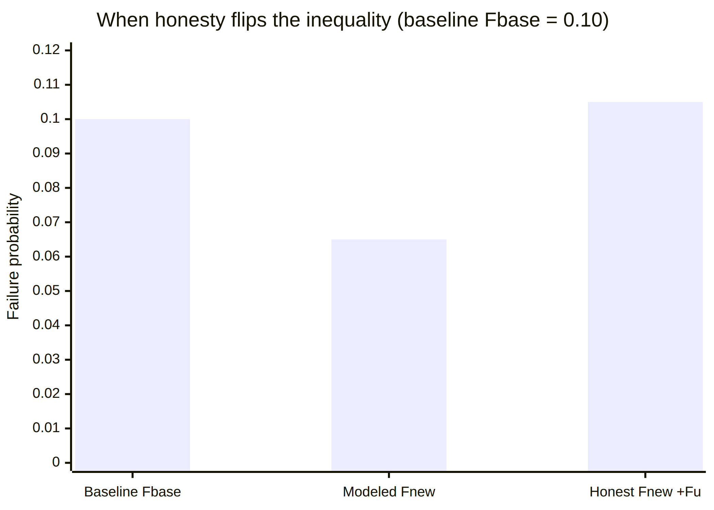{ width=75% }

*Figure 9. The §11 worked example. On modeled terms the agentic system improves (0.065 < 0.10, second bar below the baseline line). Add the unmodeled exposure $F_U$ that §12 insists on naming and the same system crosses back above baseline (0.105 > 0.10). The arithmetic is honest only when every term is on the page.*

## Proportionality bound

The §11 condition asks whether agentic AI improves reliability. A complementary constraint asks whether the introduced failure stays proportionate to baseline risk.

Define $\alpha$ as the *reliability factor for the introduced AI technology and its control mechanisms*: how much additional failure the introduced technology is allowed to contribute compared with the original baseline failure. The proportional bound is then:

$$
\frac{F_A(x) + F_C(x)}{F_{base}} \leq \alpha
$$

equivalently:

$$
F_A(x) + F_C(x) \leq \alpha \cdot F_{base}
$$

The bound gives a way to reason about whether the introduced AI capability remains proportionate to the original system risk. A system whose introduced failure exceeds $\alpha \cdot F_{base}$ may still satisfy the §11 inequality if it removes enough baseline failure, but it has crossed a separate, organisationally meaningful line: the introduced technology is contributing more failure than the system was originally willing to absorb.

The §11 inequality is about reliability arithmetic. The $\alpha$ bound is about risk policy. Both should be checked.

# 12. New failure categories are not automatically modeled

Agentic AI does not merely introduce more technical failure. It introduces new categories of failure.

| Failure class | Example |
|---|---|
| Technical failure | outage, latency, API failure, data loss |
| Reasoning failure | invalid inference, hallucination, wrong plan |
| Action failure | wrong tool call, wrong sequence, invalid command |
| Context failure | missing, stale, or misunderstood context |
| Goal failure | optimizing for the wrong objective |
| Oversight failure | human cannot detect or correct the mistake |
| Coupling failure | bad handoff between human, agent, and system |
| Emergent failure | unexpected behavior from interactions |

A simple product model does not automatically include these. They must be explicitly modeled or treated as unmodeled exposure.

These classes sort across the two axes of §6. Technical and Action failures sit primarily on the technological axis: they are properties of independent component faults. Reasoning, Context, Goal, Coupling, and Emergent failures sit primarily on the coherence axis: they are properties of the fused substrate's behaviour rather than of any single component. Oversight failure is on both. The classification is not strict; some failures sit on the boundary, and the engineer's job is to know which axis a particular failure mode is loading.

The seven stage kill chain documented by Brodt et al. [7] is a concrete instantiation of *Action*, *Coupling*, and *Emergent* failures composed across multiple inferences. Each stage in the chain (initial access, privilege escalation, reconnaissance, persistence, command and control, lateral movement, actions on objective) maps onto one or more rows above. The reliability discipline does not require a new failure class to account for it; it requires that $F_U$ be estimated honestly, including the chain dynamics.

Let:

$$
F_U(x)=\text{unmodeled or emergent failure exposure}
$$

Then:

$$
F_{agentic}=F_{base}d(x)+F_A(x)+F_C(x)+F_U(x)
$$

and:

$$
SR_{agentic}=1-\left[F_{base}d(x)+F_A(x)+F_C(x)+F_U(x)\right]
$$

The condition for improved reliability becomes:

$$
F_A(x)+F_C(x)+F_U(x)<F_{base}(1-d(x))
$$

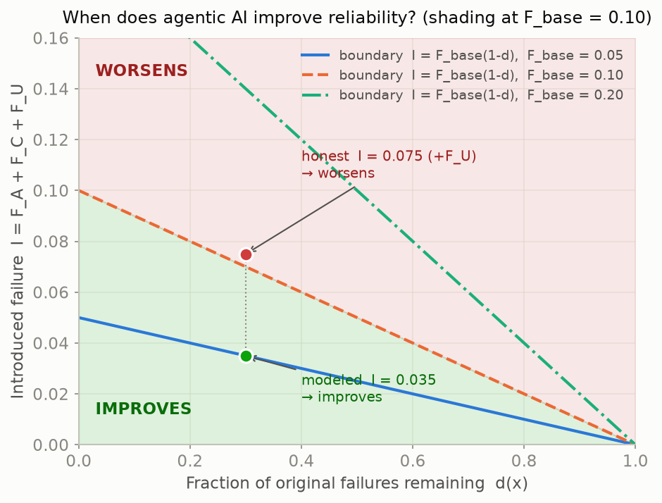{ width=75% }

*Figure 10. The improvement condition as a map. The horizontal axis is the fraction of baseline failure that survives, $d(x)$; the vertical axis is the total introduced failure $I = F_A + F_C + F_U$. Each line is the break-even boundary $I = F_{base}(1-d)$ for one baseline; below a line the agentic system improves reliability, above it the system worsens. The two markers replay the §11 worked example at $d = 0.30$: the modelled introduced failure (0.035) sits in the improve region, but adding the honest $F_U$ lifts $I$ to 0.075 — across the $F_{base}=0.10$ boundary into "worsens". The honesty flip of §11 is exactly this boundary crossing.*

## Statement 10

> The modeled reliability of an agentic system should be treated as an upper bound unless introduced failure categories are explicitly analyzed.

Or simply:

$$
SR_{actual}\leq SR_{modeled}
$$

All four failure terms above ($F_{base}$, $F_A$, $F_C$, $F_U$) sit on the technological axis from §6. Coherence-axis failures live alongside this decomposition, not inside it. A system with high $R_t$ and low $R_c$ has low $F$ on this page and a separate exposure that §6 names; a fully honest reliability assessment is the product $R_t \cdot R_c$, not $1 - F_{agentic}$ alone.

## Probabilistic operation: confidence is part of $F_U$ until it is calibrated

Every agentic output carries an implicit confidence claim. The reliability model treats it as such. For some agents the claim is explicit: a probability, a threshold, a refusal path. For most it is hidden in the prose, and the system around the agent has to guess how seriously to take what came back.

Even when a confidence number is produced, it may not be calibrated. "Ninety percent" does not mean the model is right ninety percent of the time. As Wendt [6] observes, many AI models do not provide confidence measures, and even when they do, the measures may not be well calibrated. Calibration is a property the engineer has to test, not assume.

Until tested, an agent's confidence claim is part of $F_U$, not part of $F_A$. The agent is not introducing a new failure; it is producing a number the surrounding system cannot trust without independent verification. The reliability discipline asks for confidence scores, probability distributions, thresholds, human escalation, and refusal paths in proportion to the consequence of being wrong, not in proportion to the model's enthusiasm.

# 13. Conservation of failure space, initial state, and exposure

The model so far reasons about failures as separate components added to a baseline. It does not yet reason about the system as a bounded space in which failure consumes capacity. The next three subsections close that gap and prepare the bridge to the maintenance question in §27.

## 13.1 Conservation of failure space and the remaining reliability $\beta$

Normalise the total failure space to the unit interval, where $0$ represents no failure (practically impossible) and $1$ represents the maximum total failure space (theoretically possible). Then the components from §12 plus a remaining capacity term partition the space:

$$
F_{base} + F_A + F_C + F_U + \beta = 1
$$

Define $\beta$ as the *remaining reliability space*:

$$
\beta = 1 - (F_{base} + F_A + F_C + F_U)
$$

$\beta$ is not a failure component. It is the part of the normalised system space that has not been consumed by known baseline failure, introduced AI failure, control failure, or unknown failure. The larger $\beta$ is, the more remaining reliability capacity the system has. $\beta$ is good.

## Statement 11

> $\beta$ is the part of the system that has not yet been spent on failure. The discipline is to spend it deliberately.

## 13.2 The initial system state $T_0$

At $T_0$, before maintenance, environmental exposure, and operational time are considered, the system can be viewed as consisting of three areas:

$$
T_0 = F_S + F_U + \beta
$$

Where:

- $F_S$ is the known system failure space, which on the §13.1 decomposition equals $F_{base} + F_A + F_C$.
- $F_U$ is the unknown failure space.
- $\beta$ is the remaining reliability space.

The unknown failure space $F_U$ can be understood as a grey zone. It exists already at $T_0$, but many of its effects only become visible once the system is exposed to time, usage, and environment.

A useful visualisation is a normalised vertical bar, or a horizontal stack, from $0$ to $1$, in which $F_S$, $F_U$, and $\beta$ together fill the whole system space. The discipline is to keep all three named, even when one of them is uncomfortable to admit.

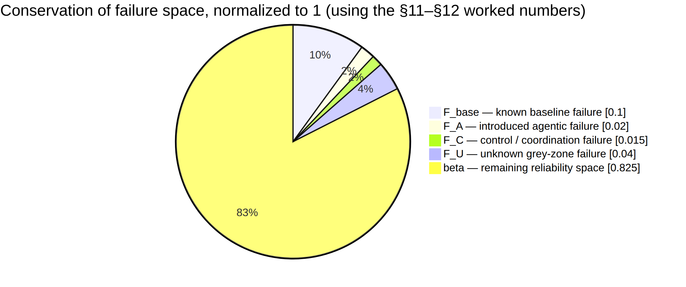{ width=78% }

*Figure 11. The partition of §13.1–§13.2: $F_{base} + F_A + F_C + F_U + \beta = 1$. The known system failure $F_S$ is the first three slices; $F_U$ is the grey zone that exists at $T_0$ already; $\beta$ (the large slice) is the capacity not yet spent on failure. The discipline is to spend $\beta$ deliberately rather than let $F_U$ quietly consume it.*

## Statement 12

> Every system has a grey zone at $T_0$ already, even if no one has yet asked the question that exposes it.

## 13.3 Exposure to time and environment: $T_e$

Although this paper is not primarily about maintenance, the model can be extended by introducing time and environmental exposure.

After time elapses and the system meets operational reality, the new state is:

$$
T_e \quad \text{or} \quad T_{exposed}
$$

The system is now exposed to both time and environment. Time and environment form the other half of the system's reality. A system is not only what is designed at $T_0$. It is also what happens when that design is exposed to operational conditions.

A short note on the term *entropy* as it is used in this paper. This is not the strict thermodynamic definition. It is the sense the engineering and systems literature has long used: the tendency of any system, once exposed to time and operational reality, to accumulate complexity, drift from its intended state, develop unmodeled couplings, and lose intelligibility. Code rots, documentation grows stale, dependencies churn, configurations diverge between environments, and assumptions outlive the conditions they were written for. None of this requires a hostile actor. It is the default trajectory of a system that no one is keeping. Entropy in this paper is the name for that default trajectory; the energy balances below are the engineering picture of what it costs to push back against it.

Maintenance and evolution can be sorted by two axes: the activity the system is receiving (bug fix, new feature, abandon, integration) and the energy balance between investment and entropy ($E_{in}$ greater than, equal to, or less than $E_{entropy}$). The table below names what each cell looks like in practice.

| Activity | $E_{in} > E_{entropy}$ | $E_{in} = E_{entropy}$ | $E_{in} < E_{entropy}$ |
|---|---|---|---|
| Bug fix only | System stabilises and slowly improves; $\beta$ grows. Surplus energy pays down debt and hardens the system. | System holds steady; $\beta$ flat. Defects are corrected as fast as they appear. | System slowly degrades; $\beta$ shrinks. Bugs pile up faster than they are fixed. |
| New feature | System grows responsibly; $\beta$ can stay flat or grow even as the system expands. Architecture, testing, refactoring, and governance receive attention. | System grows at the breakeven rate; $\beta$ flat but fragile. Any entropy spike tips into the right column. | System slowly destabilises while looking productive; $\beta$ shrinks. Features ship; complexity, technical debt, and unmodeled interactions accumulate. |
| Abandon | Rare. Only describes a system newly rescued from neglect, during the rescue period itself. | Effectively impossible in a moving environment. The environment will introduce entropy that no one is meeting. | $\beta$ collapses. $F_U$ eventually dominates. The system breaks when its surroundings change enough. |
| Integration | New integration absorbed cleanly. Contracts, observability, and error handling get attention beyond the minimum; $\beta$ stays healthy. | Integration just keeps up. $\beta$ flat but precarious. Most new integrations cannot hold this state for long. | The common reality. Coordination, monitoring, and error handling get less than they need; new failure modes accumulate faster than they are addressed. |

In practice, most operational systems oscillate between the middle and right columns. The left column is the rarest and most expensive: it requires deliberate investment beyond what is needed to keep the lights on, and it does not advertise itself in roadmaps.

The bug fix only row is where most mature stable systems live. Teams keep the lights on; the system holds. Surplus investment is uncommon, and the right cell is where systems drift when the team thins or attention moves elsewhere.

The new feature row is where most actively developed systems live. The dangerous cell is the right one. Features ship; entropy compounds; $\beta$ shrinks invisibly because the failure indicator is delayed. Roadmaps look good. Incidents arrive later, often after the people who shipped the feature have moved on.

The abandon row is where systems land when an organisation has lost its keepers. The left and middle cells are theoretical; the right cell is where the empirical record lives. Most abandoned systems eventually break, and the failure is usually attributed to whatever changed most recently in the environment, not to the abandonment that made the system fragile in the first place.

The integration row is the most volatile. New integrations briefly land in the left column when initial investment is high, drift to the middle as that investment normalises, and slip to the right as deadline pressure displaces architecture work. The transition usually happens within months. Coordinating two systems is a third system, and the third system rarely receives the energy the first two did.

Every reliability claim made elsewhere in this paper assumes the system stays in the left or middle column of the appropriate row. The right column is what §27 names as the cost of skipping the work.

## Statement 13

> Reliability is consumed by entropy and replenished by maintenance energy. It stays positive only when the energy in exceeds the entropy in.

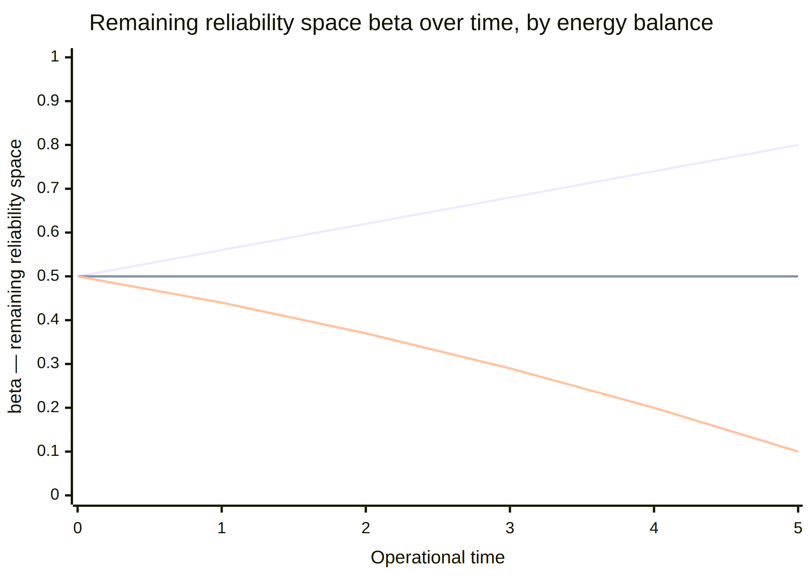{ width=75% }

*Figure 12. Statement 13 across time, three lines from a shared starting $\beta$. Top: $E_{in} > E_{entropy}$ — surplus maintenance pays down debt and $\beta$ grows (left column of the table). Middle: $E_{in} = E_{entropy}$ — breakeven, $\beta$ flat but fragile. Bottom: $E_{in} < E_{entropy}$ — entropy wins, $\beta$ shrinks invisibly while roadmaps still look good, until $F_U$ dominates.*

# 14. Gall's warning: complexity must evolve

John Gall [2] stated this. The principle is commonly summarised as:

> A complex system that works is invariably found to have evolved from a simple system that worked.

Gall wrote it as a humorous law. It is also a precise empirical claim: every working complex system in the wild has a simple working ancestor in its history; complex systems designed *de novo* are observed to fail at high rates. Parrish's reading of this law [4] adds the second order edge: every new required interaction is also a new place for unintended consequences to land.

A simple working system has:

- fewer required dependencies;
- fewer coordination points;
- fewer hidden couplings;
- fewer unmodeled interactions;
- fewer emergent failure categories.

A complex system has more of these.

Let:

$$
n=\text{number of required dependencies and interactions}
$$

Then:

$$
SR_{modeled}(n)=\prod_{i=1}^{n}R_i
$$

As $n$ increases, the modeled reliability usually decreases.

At the same time, unmodeled exposure tends to increase:

$$
F_U'(n)\geq 0
$$

So:

$$
SR_{actual}(n)=SR_{modeled}(n)-U(n)
$$

Where:

$$
U(n)=\text{unmodeled complexity penalty}
$$

## Statement 14

> Complexity reduces reliability twice: once through additional modeled dependencies, and again through additional unmodeled failure exposure.

This is where Hardin and Gall meet, and where Parrish's systems thinking framing earns its keep: the cost is paid in two ledgers, only one of which is visible.

# 15. Layer consequence: Brand plus Gall plus Parrish

Not all failures have the same consequence.

A failure in a fast, reversible layer may be tolerable. A failure in a slow, foundational layer may be severe.

An agent producing a poor draft is one kind of failure. An agent changing access control, corrupting source data, sending irreversible instructions, or redefining business rules is another.

We can express this with reliability weighted by layer:

$$
SR_{adj}=\prod_{\ell=1}^{m}\prod_{i=1}^{n_\ell}R_{\ell,i}^{w_\ell}
$$

Where:

| Symbol | Meaning |
|---|---|
| $\ell$ | system layer |
| $R_{\ell,i}$ | reliability of factor $i$ in layer $\ell$ |
| $n_\ell$ | number of required factors in layer $\ell$ |
| $w_\ell$ | consequence weight of failure in that layer |

Slow foundational layers should carry higher consequence weights:

$$
w_{governance}>w_{output}
$$

$$
w_{identity}>w_{prompt}
$$

$$
w_{data\ integrity}>w_{formatting}
$$

In Parrish's framing, this is leverage analysis: the deepest layers are where small changes have the largest second order effects, so they earn the highest reliability burden.

## Statement 15

> The deeper the layer, the higher the burden of reliability evidence.

# 16. Security as a reliability concern

The reliability inequalities developed in §11 and §12 implicitly assume the agent cannot escape the failure categories they describe. If the agent can rewrite the rules of its own operation, the inequalities are no longer describing the system that actually exists. That is the reliability reason this paper has anything to say about security at all.

This is not a paper about how to secure an agentic system. It is a paper about reliability, and security enters only where reliability claims would otherwise overstate the actual system.

The older tradition is the *reference monitor* concept from operating systems security, articulated in Anderson [9] and developed in Saltzer and Schroeder [10]: an enforcement mechanism that is tamperproof, always invoked, and small enough to be analysed. The agentic case does not change the principle. It only changes which entity the mechanism is constraining.

The contemporary identity stack that has grown around agentic systems (workload identity through SPIFFE and WIMSE, delegated authorization through OAuth 2.0 and OpenID Connect, the Model Context Protocol and Agent2Agent protocol for tool and peer integration, the IETF drafts on agent authorization, and frameworks such as CoSAI's imperatives for non-human identity) is one specific instantiation of the same older idea for the agentic case. The paper does not endorse a particular stack. It expects the engineer to choose one whose properties survive the §12 failure categories.

## Axiom 3: Authority must be enforced from outside the agent

Whatever bounds an agent's behavior (what it may call, who it may act as, how much it may spend, what it may write to, what it may read from) must be enforced by mechanisms the agent cannot bypass. A bound that lives in the agent's prompt, in its plan, in its training, or in its instructions is not a bound. It is a request the agent has been encouraged to honor.

This rule does not live in one layer. Following the layered view from §3, security spans the stack: identity providers and authorization policies in the slow layers; runtime gating, monitoring, and accounting at the platform layer; constraints inside the agent in the fast layer, where they are useful but cannot carry the load alone. No single layer carries the whole weight. Defense in depth is not a security cliché in this context; it is the only configuration in which the reliability model in §12 stays honest.

The shape of these mechanisms is contextual. Exactly which layer enforces identity, which enforces authorization, and which records what the agent did depends on the system. A small internal tool with a single trusted operator and a tightly scoped action set has different requirements than an agent serving many users and acting on their behalf against external systems. Identity is the most contextual of all: an agent may inherit the calling user's identity, hold its own, or operate through a chain of delegations, and any of these can be correct in the right setting. The reliability question is not which scheme is right; it is whether the chosen scheme is enforceable from outside the agent and reconstructable through audit.

The agent's permissions and the agent's actions are not the same set. A static permission set bounds what a deterministic actor will do because the actor's behavior is determined by its inputs in a predictable way. An agent's behavior is determined by prompt, context, and the outputs of upstream agents in ways that the permission set never sees. The same agent with the same permissions can take different actions on Tuesday and on Wednesday. This is why static, design time permissions cannot bound an agent the way they can bound a human user. The bound has to be reasserted at the moment of action, by the system around the agent, against what the agent is actually trying to do right now.

Huang and Hughes [12] describe the same mechanism explicitly: agentic AI systems using LLMs exhibit inherent non-determinism, and the same prompt can produce different outputs even when code and configuration remain unchanged. Díaz, Kern, and Olive [13] add the design corollary, that agent security needs deterministic controls combined with reasoning-based defenses, since non-deterministic model-based defenses cannot provide absolute guarantees and must work alongside deterministic controls, especially for critical or irreversible actions. This is the same defense in depth posture the section above already names.

This argues directly for limiting the agent's *standing* authority, a point developed in [11]. An agent that holds permanent permissions has a continuous draw on the system's reserve from §13.1: it consumes the right to act, whether it is acting or not, and any failure mode that lets it act badly inherits the full breadth of what it was ever allowed to do. Authority granted at the moment of action, scoped to that action, and revoked when the action ends keeps the surface small. Standing privilege is a permanent withdrawal from $\beta$. Just-in-time authorization is the discipline that protects it.

Multi-hop delegation is the same problem at the chain, also developed in [11]. An agent acting on behalf of a human, calling a second agent that calls a third, builds a chain that the original authorization has to traverse intact. Scope must attenuate at every hop, never expand. Attribution must be preserved end to end, so that an action at the far end of the chain can be traced back to the human who initiated it. A chain whose middle link silently widens scope, or loses the originator, is exactly §12's *Coupling failure* and *Action failure* materialised. The chain is reliable only if no link in it can elevate the authority granted to it.

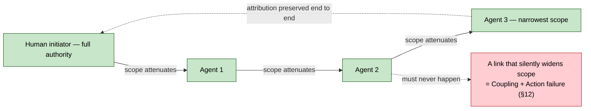{ width=100% }

*Figure 13. Multi-hop delegation. Scope must attenuate at every hop (solid arrows narrowing), and attribution must trace back to the originating human (dashed return). A middle link that widens scope or loses the originator is §12's Coupling and Action failure materialised.*

Memory, retrieval, and tools deserve the same skepticism. Brodt et al. [7] document how each of these three substrates becomes a control channel rather than a data channel under attack: a payload deposited in agent memory survives across sessions and re-emerges on later inference; poisoned content in a retrieval store is fetched back into a prompt that should have been stable; tool integrations let a single compromise propagate laterally to other agents and other users. The reliability response is structural, not novel. Memory and retrieval substrates are part of the surface that has to be kept untrusted by default, sanitised before retrieval, and reset on a schedule that does not depend on attacker quiescence. Tool reach is part of the standing authority that §16 already argued should not stand. The kill chain is not a new failure class. It is the documented case for why the existing enforcement boundaries have to hold across time as well as across calls.

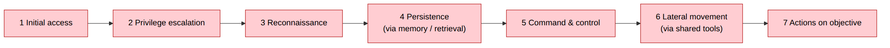{ width=100% }

*Figure 14. The seven-stage promptware kill chain of Brodt et al. [7], mapping onto §12's Action, Coupling, and Emergent classes composed across multiple inferences. Persistence rides the memory and retrieval substrates; lateral movement rides shared tools — the same mechanisms §4 relied on to separate layers, now used to migrate attacker state across them in time.*

In broad terms, the questions worth answering for any agentic system are familiar from the protection literature: who is the agent acting as, what is it permitted to do, what side effects require explicit approval, what constraints on time and resources can it not lift on its own, and what trace remains after it acts. The agentic case adds urgency to these questions, not novelty.

## Statement 16

> An agent's authority is whatever the system around it enforces. Anything weaker than that is hope.

Two practical consequences follow. First, identity attacks specific to LLM agents (a fabricated token presented as a credential, a forged on behalf of header, a hallucinated approval) are not a separate identity ledger. They are concrete instances of the §12 *Reasoning* and *Action* failure classes, and they belong inside $F_A$ or $F_U$ where the model already accounts for them. The engineering response is the same as for any other action failure: the reliability claim is honest only if the enforcement is sited where the agent cannot reach.

Second, the corollary, addressed to the engineer, is that the enforcement is rebuilt every time the system around the agent changes: new tools, new models, new integrations, new tenants. A configuration that was sound yesterday and undefended today has not regressed in capability. It has stopped being something whose reliability anyone can honestly model.

The argument above sits at a recognised intersection. The operational tradition names reliability, availability, maintainability, and safety (RAMS) as the protection goals of service delivery. The security tradition names confidentiality, integrity, and availability (CIA) as the protection goals of information assets. Availability is the dimension both traditions share. What this section calls "enforcement from outside the agent" is, in CIA terms, the integrity boundary that protects the agent's authorisation state, and the confidentiality boundary that prevents leakage between sessions. In RAMS terms, the same enforcement is what makes the reliability and availability claims of §11 and §12 honest. Operations and security are not separate concerns at this boundary. They are the same boundary, named twice.

## From one agent to many: laws as the population-scale form of authority

The argument so far has been about a single agent and the system around it. Once there are many agents, interacting at machine speed, the same argument has to be restated at a different scale.

Parrish [4] reads the historical record on this directly. Laws in dense human societies emerged from the practical need to resolve conflicts, establish predictable cooperation between strangers, and constrain free-riders. The denser the population and the higher the stakes of interaction, the stronger the pressure for codified rules and external enforcement. Voluntary norms hold thinly populated communities together; populated systems require law.

Multi-agent AI populations exhibit the same dynamic at speeds humans cannot match. Autonomous agents acting on behalf of different users, vendors, and organisations will encounter conflicts, opportunities for collusion, and incentives to extract value at the expense of peers. The cooperative AI and multi-agent governance literature on arXiv has begun to formalise frameworks for this case: constraints on agent action, auditing of inter-agent communication, cooperation and coordination protocols, mechanisms for conflict resolution, and detection of collusive behaviour. The shared property of this work is that the rules live outside the agents; they are not negotiated by the agents themselves.

This is the population-scale form of Statement 16. An individual agent's authority is whatever the system around it enforces. A population of agents' behaviour is whatever the *governance* around it enforces. The two claims are the same claim. Reliability and security work for a single agent are not enough once interaction at population scale begins; the discipline has to extend to the rules that govern the population.

The conclusion is sharper than analogy. As agentic AI scales, the evolution of explicit laws for AI agent governance becomes as practically necessary as the evolution of laws was for human societies, and for the same structural reason: the alternative is unbounded conflict and unbounded externalised cost.

# 17. Reliability is not quality

A system can become less reliable while producing better outputs when it succeeds.

So we distinguish:

$$
SR=\text{probability of acceptable operation}
$$

from:

$$
Q=\text{quality of successful output}
$$

Agentic AI may reduce reliability while increasing quality.

Define:

$$
V=SR\cdot Q
$$

Where:

| Symbol | Meaning |
|---|---|
| $V$ | expected value of output |
| $SR$ | reliability |
| $Q$ | quality of successful output |

It is possible that:

$$
SR_{agentic}<SR_{base}
$$

while:

$$
V_{agentic}>V_{base}
$$

because:

$$
Q_{agentic}\gg Q_{base}
$$

## Statement 17

> A quality argument must not be mistaken for a reliability argument.

This distinction matters because many agentic AI justifications are actually claims about quality, speed, cost, or capability. Those claims may be valid. They are just not the same claim.

# 18. Reliability is not resilience

A second distinction. Reliability is not the inverse of resilience, and the two are not the same property.

Reliability concerns the probability that a system continues to operate correctly under expected conditions. The model developed in §11, §12, and §13 is a reliability model. It asks how often the system fails. Reliability work is *preventative*: stability, fault avoidance, redundancy, correctness, predictable operation. The job is to keep failure from happening.

Resilience concerns what happens once a failure has begun. It asks how badly the failure hurts and how quickly the system returns to acceptable operation. Resilience work is *recoverative*: it addresses uncertainty, partial failure, operational degradation, recovery orchestration, adaptability, and continuity under stress. The job is to limit the consequences when failure does happen.

These are complementary properties, not equivalent ones. A highly reliable system may still be fragile, in the sense that when it does fail, it fails completely and recovery is slow. A resilient system acknowledges that failure is unavoidable and is engineered to maintain or rapidly restore acceptable levels of operation under degraded conditions.

Reliability reduces the *frequency* of incidents. Resilience reduces their *impact* and *recovery time*. The two together determine what the system actually does to its users over time. Either one alone is insufficient.

In the model: where exposure-time reliability $R(\tau)=e^{-\lambda\tau}$ in §19.2 measures the rate $\lambda$ at which failures arrive, the resilience side measures the rate at which the system returns to acceptable operation after a failure. The two rates are independent. A system with $\lambda$ small but recovery slow is reliable but fragile. A system with $\lambda$ larger but recovery instantaneous can be operationally preferable for the same outcome over time.

The outcome vector $O(x)=(SR,Q,\tau,C)$ in §21 captures reliability through $SR$. It does not separately capture resilience. The vector should be read with this in mind. Two systems with the same $SR$ may differ profoundly in how they fail and how quickly they return; the engineering case for one is not the engineering case for the other.

Modern distributed and cloud-native environments require both, because complex systems cannot eliminate all failure modes through reliability measures alone. The kill chain in §16, the conservation of failure space in §13, and the maintenance handoff in §27 all assume that some failures will occur. Resilience is what determines what happens after they do.

Both axes of §6 have their own resilience profile. Technological resilience is the system's ability to recover from the model crashing or an API failing. Coherence resilience is the system's ability to recover from the system producing inconsistent or drift-affected outputs. The two are not the same recovery problem and they are not addressed by the same mechanisms.

## Statement 18

> Reliability is the probability that a system continues to operate correctly. Resilience is what determines what the system does when it does not. They are complementary properties, not the same property and not the inverse of each other, and a reliability discipline alone is not enough for systems that operate where failure is inevitable.

# 19. Time as a separate dimension

Agentic AI may reduce the time needed to produce an acceptable result.

Let:

$$
\tau=\text{time to produce, check, or operate}
$$

Then:

$$
\tau_{agentic}<\tau_{base}
$$

may be a significant benefit.

But time has at least two meanings.

## 19.1 Cycle time reduction

Cycle time reduction means:

> The same or better output is produced faster.

A useful speed ratio is:

$$
K_\tau=\frac{\tau_{base}}{\tau_{agentic}}
$$

If:

$$
K_\tau>1
$$

then the agentic process is faster.

This is primarily a throughput benefit.

## 19.2 Exposure time reduction

Exposure time reduction means:

> The system spends less time in a state where failure can occur.

If failures occur over time at rate $\lambda$, then reliability over time can be modeled as:

$$
R(\tau)=e^{-\lambda\tau}
$$

This is the constant failure rate model from reliability engineering: if independent failure events arrive as a Poisson process with rate $\lambda$, the probability of zero failures in an interval of length $\tau$ is $e^{-\lambda\tau}$. It is the standard reliability function for memoryless failure processes; any reliability textbook (for example Birolini [14]) sets it out the same way.

Shorter exposure time improves this factor:

$$
\tau_{agentic}<\tau_{base}\Rightarrow e^{-\lambda\tau_{agentic}}>e^{-\lambda\tau_{base}}
$$

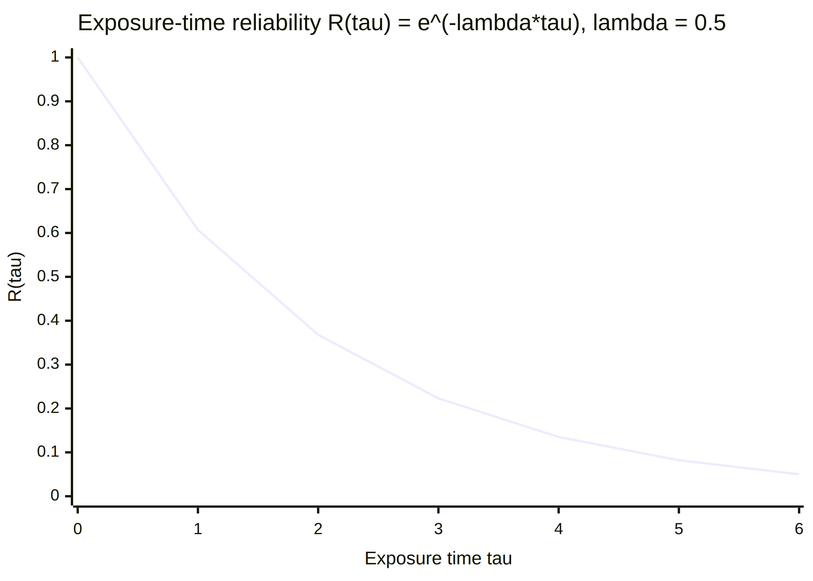{ width=75% }

*Figure 15. The constant-failure-rate model of §19.2. Because the curve is convex, cutting exposure time $\tau$ moves reliability up the steep left part of the curve. This is the reliability sense of "faster": less time spent in a state where failure can arrive, distinct from the throughput sense in §19.1.*

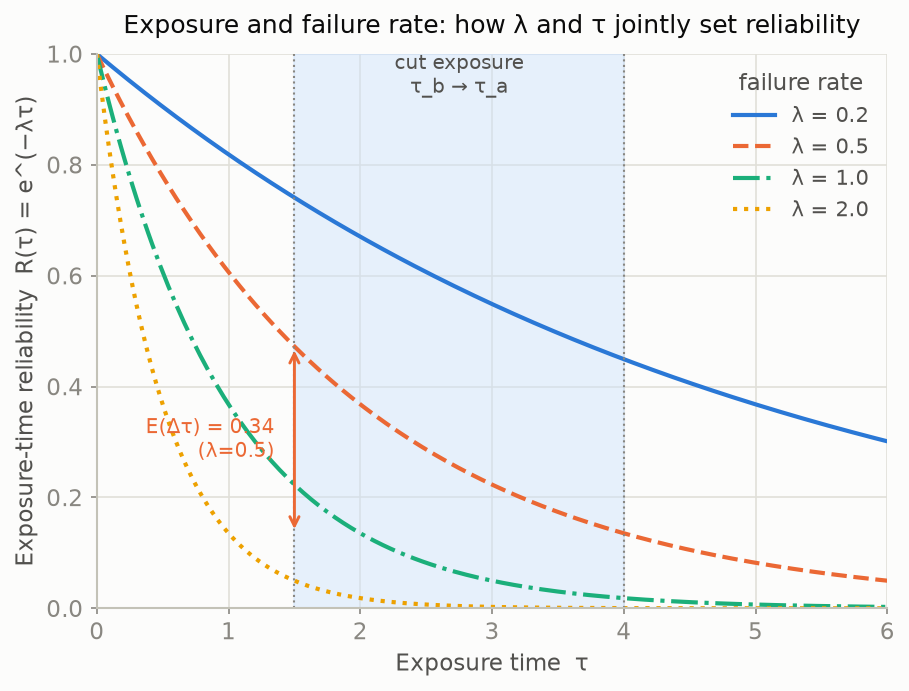{ width=80% }

*Figure 16. The same $R(\tau)=e^{-\lambda\tau}$ across a family of failure rates $\lambda$. Two variables set the reliability: which curve you are on ($\lambda$) and where along it you sit ($\tau$). The shaded band is a cut in exposure from $\tau_b$ to $\tau_a$; the arrow marks the reliability recovered, $E(\Delta\tau)=e^{-\lambda\tau_a}-e^{-\lambda\tau_b}$ — the exposure-time term that reappears in the §23 decision test. The steeper the curve (higher $\lambda$), the more a given cut in exposure buys.*

## Statement 19

> Time reduction can be a productivity benefit, a reliability benefit, or both. It depends on whether shorter time also reduces exposure to failure.

# 20. Combined reliability model

A semantic reliability model with complexity, failure, and time can be written as:

$$
SR_{actual}(x)=\left(\prod_{i=1}^{n}R_i(x)\right)\cdot e^{-\lambda\tau(x)}-U(n)+G(x)
$$

Where:

| Term | Meaning |
|---|---|
| $\prod R_i(x)$ | modeled reliability chain |
| $e^{-\lambda\tau(x)}$ | exposure time reliability factor |
| $U(n)$ | unmodeled complexity penalty |
| $G(x)$ | validated reliability gain |
| $x$ | degree of agentic support or delegation |

This is not a formal proof. It is engineering logic.

The formula says that agentic AI can help reliability through validated control gain and reduced exposure time. But it can also hurt reliability by adding required dependencies and unmodeled failure categories.

The question is which force dominates.

The combined model is, strictly, the technological-axis combined model. The full agentic case requires evaluating $R_c$ separately, and the system's effective reliability is the product $R_t \cdot R_c$ as named in §6. The formula above gives $R_t$; the coherence axis sits alongside it and has to be carried separately.

# 21. Outcome vector instead of one score

Because agentic AI changes several dimensions at once, the cleanest representation is an outcome vector:

$$
O(x)=\left(SR(x),Q(x),\tau(x),C(x)\right)
$$

Where:

| Symbol | Meaning |
|---|---|
| $SR(x)$ | actual reliability |
| $Q(x)$ | output quality |
| $\tau(x)$ | time, cycle time, or exposure duration |
| $C(x)$ | cost |

The baseline system is:

$$
O_{base}=\left(SR_b,Q_b,\tau_b,C_b\right)
$$

The agentic system is:

$$
O_{agentic}=\left(SR_a,Q_a,\tau_a,C_a\right)
$$

Then the design discussion becomes more honest.

| Condition | Interpretation |
|---|---|
| $SR_a>SR_b$ | reliability improvement |
| $Q_a>Q_b$ | quality improvement |
| $\tau_a<\tau_b$ | time improvement |
| $C_a<C_b$ | cost improvement |
| $SR_a<SR_b$, but $Q_a$ much higher | quality tradeoff |
| $SR_a<SR_b$, but $\tau_a$ much lower | throughput tradeoff |
| $SR_a<SR_b$, but $C_a$ much lower | economic tradeoff |

## Statement 20

> Agentic AI should be evaluated as a multidimensional design change, not as a reliability improvement by default.

The $SR$ component in the outcome vector is itself the product $R_t \cdot R_c$ from §6. Two systems with the same $SR$ may differ in which axis is dominant: one operationally fragile but coherent, the other operationally stable but semantically inconsistent. The engineering case for one is not the case for the other.

# 22. Value per unit time

If one compressed metric is needed, a useful expression is:

$$
V(x)=\frac{SR(x)\cdot Q(x)}{\tau(x)}
$$

Where:

| Symbol | Meaning |
|---|---|
| $V(x)$ | expected quality weighted value per unit time |
| $SR(x)$ | reliability |
| $Q(x)$ | quality |
| $\tau(x)$ | time |

This allows the agentic system to be valuable even if it is not more reliable.

But this must be constrained.

A fast, impressive, unreliable system is still unacceptable in contexts where reliability is a hard requirement.

So compare:

$$
V_{agentic}>V_{base}
$$

only after checking:

$$
SR_{agentic}\geq SR_{min}
$$

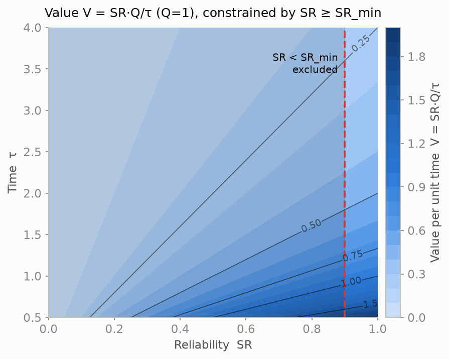{ width=70% }

*Figure 17. The compressed metric $V = SR \cdot Q / \tau$ (with $Q = 1$) drawn as a field over reliability and time. Value grows toward the bottom-right — high $SR$, low $\tau$ — and the diagonal contours are lines of equal value, so a fast unreliable system and a slow reliable one can share one. The constraint of Statement 21 is the vertical cut: everything to the left of $SR_{min}$ is inadmissible however high $V$ climbs, which is why value optimization must be constrained, not maximized freely.*

## Statement 21

> Value optimization must be constrained by minimum acceptable reliability.

# 23. Design decision criteria

The strict reliability test is:

$$
F_A(x)+F_C(x)+F_U(x)<F_{base}(1-d(x))+E(\Delta\tau)
$$

Where:

| Symbol | Meaning |
|---|---|
| $F_A(x)$ | agentic failures introduced |
| $F_C(x)$ | coordination and control failures introduced |
| $F_U(x)$ | unmodeled and emergent failures introduced |
| $F_{base}(1-d(x))$ | original failures removed |
| $E(\Delta\tau)$ | failure reduction from shorter exposure time |

The exposure time gain follows directly from §19:

$$
E(\Delta\tau)=e^{-\lambda\tau_a}-e^{-\lambda\tau_b}\quad (\text{positive when } \tau_a<\tau_b)
$$

This says:

> Agentic AI improves reliability only if the failures it removes and exposure it reduces exceed the failures and uncertainty it introduces.

For broader value, compare:

$$
\frac{SR_aQ_a}{\tau_a}>\frac{SR_bQ_b}{\tau_b}
$$

subject to:

$$
SR_a\geq SR_{min}
$$

and:

$$
F_U(x)\text{ has been explicitly considered}
$$

# 24. Practical design principles

## Principle 1: Do not count capability as reliability

A system may become more capable without becoming more reliable.

## Principle 2: Do not hide new failure modes inside "AI reliability"

Agentic systems introduce reasoning, action, context, oversight, coupling, and emergent failures.

## Principle 3: Count occurrences

Five agentic actions are not one agentic action repeated politely. They are five required reliability exposures.

## Principle 4: Keep fast layers constrained by slow layers

Agentic behavior should not silently redefine authority, governance, data integrity, or accountability.

## Principle 5: Treat complexity as reliability debt

Every new dependency must earn its place.

## Principle 6: Require validated gain

The agentic layer must demonstrate measurable failure reduction, not merely theoretical usefulness.

## Principle 7: Separate reliability, quality, time, and cost

Do not compress all benefits into the word "better".

## Principle 8: Prefer evolved complexity

Start with a simple working system. Add agentic behavior incrementally. Let reliable patterns evolve before embedding them in deeper system layers.

## Principle 9: Make reversibility a design requirement

The first deployment location for agentic behavior should be where errors are visible, bounded, auditable, and reversible.

## Principle 10: Demand more evidence near foundational layers

The closer an agentic system gets to authority, identity, data integrity, irreversible action, or safety critical control, the higher the burden of proof.

## Principle 11: Enforce authority from outside the agent

Whatever bounds the agent's behavior must be enforced by mechanisms the agent cannot bypass, distributed across the layers around the agent rather than concentrated in any single one. The specific mechanisms (identity, authorization, gating, limits, auditing) are familiar from the protection literature; the contextual question is which layer carries which piece in the system at hand. This is the engineer's permanent responsibility, refreshed every time the system around the agent changes. An agent's authority is whatever the system around it enforces; nothing weaker counts.

# 25. Final synthesis

The final semantic model is:

$$
O(x)=\left(SR(x),Q(x),\tau(x),C(x)\right)
$$

with:

$$
SR(x)=1-\left[F_{base}d(x)+F_A(x)+F_C(x)+F_U(x)\right]+E(\Delta\tau)
$$

and:

$$
V(x)=\frac{SR(x)Q(x)}{\tau(x)}
$$

subject to:

$$
SR(x)\geq SR_{min}
$$

This gives a disciplined way to ask:

| Question | Test |
|---|---|
| Is it more reliable? | $SR_a>SR_b$ |
| Is it higher quality? | $Q_a>Q_b$ |
| Is it faster? | $\tau_a<\tau_b$ |
| Is it cheaper? | $C_a<C_b$ |
| Is it higher expected value per time? | $\frac{SR_aQ_a}{\tau_a}>\frac{SR_bQ_b}{\tau_b}$ |
| Is the agent's authority enforced from outside it? | identity, authorization, gating, limits, auditing distributed across the layers around the agent |
| Is it acceptable? | $SR_a\geq SR_{min}$ and $F_U$ has been considered |

# 26. Two regimes and a decision gap: when the discipline does not apply, and when adoption ignores it

Twenty-three sections of engineering discipline have established the conditions under which agentic AI is reliability positive. The honest reader at this point has a question. If the conditions are met so rarely, why is agentic AI being deployed at this pace?

There are two answers, and both are real.

## 26.1 Two regimes: throwaway and durable

Not every artifact a system produces is meant to last. A whiteboard sketch is not a building. A draft is not a contract. A prototype is not a product. A demo is not a deployment. These are *communication artifacts*: produced quickly, used to convey or test an idea, and discarded when their purpose is served.

Agentic AI, for the first time at scale, makes communication artifacts cheap to produce at high fidelity. A working UI mockup with realistic looking data, a functioning prototype service, an interactive demo of a product that does not yet exist, a draft analysis, a sample report. These are now hours of work, not weeks. The cycle time of communication has collapsed. This is genuinely new.

In the throwaway regime, reliability is not a load bearing property. The mockup does not need to handle traffic. The prototype does not need to recover from failure. The draft does not need consistent behaviour across reads. The artifact's job is to communicate, and once the communication is done, the artifact can be deleted. The discipline in this paper does not apply, not because it is wrong, but because the regime has different load bearing properties: speed of iteration, fidelity to intent, ease of revision.

The durable regime is everything else. A system that takes a transaction. A service that holds state across calls. An integration whose other end depends on it. A pipeline that produces numbers someone will base a decision on. A workflow that compounds over time. Anything that has to keep working when the original author is no longer in the room.

The reliability discipline applies, fully and without exception, in the durable regime.

The two regimes are not the same thing dressed differently. They have different value functions, different time horizons, different acceptable failure rates, different maintenance profiles, and different organisational owners. The throwaway regime cares about one cycle. The durable regime cares about every cycle, into the future, after the people who built it have moved on.

This explains a surprising amount of agentic AI deployment that looks reckless from the engineering side. It is not reckless. It is throwaway regime work, deployed throwaway, used throwaway, discarded after use. The engineering inequalities never had to hold. The decision was correct.

The disaster pattern is the regime transition.

It is the demo that succeeds and gets shipped to production without being rebuilt. The prototype that goes live because it "already works." The CEO experiment vibecoded over a weekend that becomes the payment service. The draft analysis that becomes the basis for a board decision. The mock UI that becomes the product because nobody had budget to build the real one. In each case, an artifact that was correct in the throwaway regime is moved across the boundary into the durable regime, where the reliability discipline does apply, and the discipline was not done.

The regime confusion is the failure mode this paper is most concerned with. The throwaway regime is genuinely valuable; the durable regime is genuinely demanding; the failure happens at the boundary, when an artifact crosses from the first to the second without anyone noticing it has crossed.

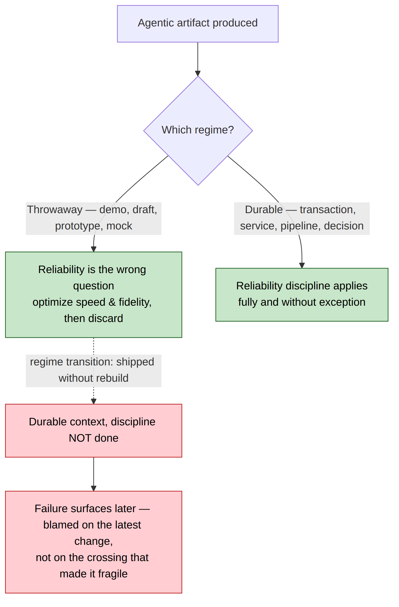{ width=60% }

*Figure 18. Statement 22. Both regimes are legitimate — the throwaway branch is a correct decision, not recklessness. The disaster is the dashed edge: an artifact correct in the throwaway regime moved across the boundary into the durable regime without being rebuilt for it.*

## Statement 22

> The reliability discipline applies to the durable regime. In the throwaway regime, agentic AI is a communication tool, and reliability is the wrong question. The disaster is the regime transition: throwaway artifacts moved into durable contexts without being rebuilt for them.

## 26.2 The decision utility gap

Even within the durable regime, agentic AI is being deployed at a pace that the engineering inequalities do not justify. The reason is not that decision makers are unaware of the inequalities. The reason is that they are optimising a different function.

The paper's value function is engineering value:

$$
V_{eng}(x)=\frac{SR(x)\cdot Q(x)}{\tau(x)} \quad \text{subject to} \quad SR(x)\geq SR_{min}
$$

The function actually being optimised at decision time is closer to:

$$
V_{decision}=V_{eng}+S+O-R_{career}^{miss}-C_{externalised}
$$

Where:

| Term | Meaning |
|---|---|
| $V_{eng}$ | engineering value, as defined in §22 |
| $S$ | signalling value: being seen to deploy AI signals modernity to investors, recruits, regulators, board, and customers; the signal pays even when the agent fails |
| $O$ | optionality value: even an unreliable agent that occasionally unlocks something previously impossible has option value; the engineering ledger penalises failures, the optionality ledger rewards rare wins |
| $R_{career}^{miss}$ | career risk of *not* adopting; for most decision makers, "missed the AI wave" is a larger career risk than "deployed AI that failed in the way everyone else's also failed" |
| $C_{externalised}$ | failure cost borne by someone other than the buyer; most agentic deployments push the failure cost onto operators, security teams, customers, downstream systems, or future quarters |

These are not irrational arguments. They are different arguments. When $S$ and $-R_{career}^{miss}$ together exceed the loss from a small $V_{eng}$, the decision to adopt is rational on its own terms, even when the engineering case fails. The decision is not optimising the same function the paper has been writing about.

The empirical record agrees. Gartner forecasts that more than 40 percent of agentic AI projects will be cancelled by the end of 2027 due to escalating costs, unclear business value, or inadequate risk controls; deployment continues regardless [15]. The WRITER 2026 enterprise survey of 1,200 C-suite executives and 1,200 knowledge workers finds that 75 percent of executives admit their AI strategy is "more for show" than actual internal guidance, that 67 percent believe their company has already suffered a data leak or breach from an employee using an unapproved AI tool, and that 60 percent of companies plan to lay off employees who do not adopt AI [16]. The CISA *Careful Adoption of Agentic AI Services* [17], co-authored with the Five Eyes security agencies of the United Kingdom, Canada, Australia, and New Zealand, exists *because* the gap exists. The [un]prompted Con AI security practitioner conference [18] exists for the same reason. Breunig [19] names the pattern. The record is well documented.

## Statement 23

> The decision to deploy agentic AI is optimising a function whose arguments include signalling, career risk asymmetry, externalised failure cost, and optionality. When these dominate, the engineering inequalities are ignored not because they are wrong, but because they are not the function being optimised at decision time.

## 26.3 What the engineer should do

The two answers above leave the engineer in a specific position, and it is worth stating plainly.

The engineer's job is not to refuse the throwaway regime. It is genuinely valuable, genuinely fast, and genuinely a new tool for human communication. The engineer's contribution there is to help the artifact be built and discarded cleanly, without the regime transition pattern silently turning it into something else.

The engineer's job is not to defeat the decision utility gap. The forces are real and the decisions are not always wrong. The engineer's contribution is to keep the engineering inequalities visible, especially at the regime transition, so the gap is documented rather than hidden. A decision to deploy in the durable regime despite a failed inequality is a defensible decision; a decision to deploy in the durable regime *without anyone naming the failed inequality* is not.

The work the maintenance handoff in §27 describes is what arrives later, when the decision utility gap and the regime transition combine: a system was deployed at an early stage of one optimisation, and the engineering inequalities now have to hold for an unfamiliar long stretch of the other.

That is the bill the engineering side eventually pays.

A final widening of frame. Harris [21] argues that morality can be grounded in measurable well-being rather than purely in subjective philosophy or religion, and proposes well-being as the target a moral system should optimise. Whatever one thinks of the philosophical claim, the engineering implication is sharp. Humans carry an organic moral substrate, built by evolution, empathy, biology, culture, and conditioning. Agentic AI does not. Whatever ethics an agentic system has is whatever the scaffolding around it enforces, in exactly the sense Statement 16 already names for authority. The reliability discipline this paper has been describing therefore becomes a moral discipline in the AGI case. A failed enforcement boundary is not only a security incident; it is, in a literal sense, a failure of the only moral substrate the system has. The engineering inequalities and the moral inequalities are the same inequalities, and the engineer is the one keeping them honest.

# 27. Reliability is kept, not shipped: the maintenance handoff

The discipline above describes a system at decision time. It does not describe the system a year later, after tools have been replaced, models upgraded, integrations rerouted, regulations changed, attackers adapted, and the original engineer has moved on. None of the inequalities in §20 or §23 stay true automatically. They stay true because someone keeps making them stay true.

A system that improves reliability in May does not still improve reliability in November unless its tool layer, its $F_U$ assumptions, its $\lambda$ on the exposure time term, and its consequence weights $w_\ell$ are revisited as the world that surrounds the system shifts. Each of those parameters drifts; the inequality does not. The energy balance in §13.3 is the underlying reason: in mode 3, $\beta$ shrinks and the modeled reliability stops describing the system that actually exists.

The principle is not specific to agentic AI. Every durable technical system pays this tax. The tax is called *maintenance*, which Brand reads as the continuous editing of intent against reality, or simply the work that lets a working system keep working. The deeper treatment of this property, including its accounting, its organisational form, and its relation to entropy, lies outside the scope of this paper. What belongs here, and only here, is the precondition: every reliability claim made above is a maintenance claim in disguise.

The architecture literature names the same drift at the landscape level:

> Without an agreed plan and coordination, the system landscape will, over time, reflect the functional silos and isolated objectives and requirements adopted by the business.
>
> Akenine et al. [20].

A reliability claim made for one system is local. The drift the architects describe is what happens when many such claims are made in isolation, by silos with their own objectives, and no coordination across them. The discipline in this paper is necessary but not sufficient at landscape scale; the right column of §13.3 generalises to a portfolio when no one is keeping it together.

> A system is not finished when it works. It is finished when it can keep working.

Treat the seven tests in §25 as a *recurring* review, not a launch checklist. The enforcement boundaries in §16 are refreshed, not signed off. The unmodeled exposure $F_U$ is estimated again each time the system's neighbourhood changes. The discipline in this paper is durable; the system to which you applied it is not.

The work that keeps the discipline true over time is the work that keeps the system real. That work has its own literature, its own axioms, and its own organisational shape, and that is where the conversation continues.

# 28. Conclusion

Agentic AI should not be treated as a direct reliability improvement by default.

From Hardin, we inherit the warning that system reliability is multiplicative. Required human and technical factors combine, and every imperfect required dependency reduces modeled system reliability.

From Brand, we inherit the warning that systems are layered. Fast layers must not destabilize slow foundational layers.

From Gall, we inherit the warning that complex working systems must evolve from simple working systems. Complexity added too early is not sophistication. It is often just a larger failure surface wearing a nicer jacket.

From Parrish, we inherit the systems thinking discipline of distinguishing slow variables from fast ones, of accounting for second order effects, and of locating leverage where the system actually moves, not where the diagram says it should.

Agentic AI can still be valuable. It may improve quality, reduce time, lower cost, increase throughput, improve detection, or reduce exposure to failure. But those are distinct claims.

The strict reliability claim is justified only when:

$$
\text{failures prevented} + \text{exposure time failures avoided} > \text{failures introduced} + \text{unmodeled complexity exposure}
$$

If that condition is not met, the argument may still be a valid quality argument, time argument, cost argument, or capability argument. It is just not a reliability argument.

The practical engineering position is therefore:

> Add agentic behavior where its validated reliability gain, quality gain, or time gain outweighs the dependency cost, coordination cost, and new failure categories it introduces. Start with a simple working system. Keep agentic behavior bounded, observable, reversible, and layered. Enforce the agent's authority from outside it: identity, authorization, gating, limits, and auditing live across the layers around the agent, not inside it. Let complexity earn its place.

The Gardner test applies. This is a discipline only if you can apply it appropriately to a system you have not yet seen.

# References

Numbered in order of first citation in the body. Inline references appear as [N] markers throughout.

[1] Garrett Hardin. *Filters Against Folly: How to Survive Despite Economists, Ecologists, and the Merely Eloquent.* Viking, 1985. Public summary of the three filters: <https://fs.blog/garrett-hardin-three-filters/>.

[2] John Gall. *General Systemantics: An Essay on How Systems Work, and Especially How They Fail.* 1975. Later editions retitled *Systemantics: How Systems Work and Especially How They Fail* and *The Systems Bible*. Public summary: <https://en.wikiquote.org/wiki/John_Gall>.

[3] Stewart Brand. *How Buildings Learn: What Happens After They're Built.* Viking, 1994. Pace layering essay: <https://jods.mitpress.mit.edu/pub/issue3-brand>.

[4] Shane Parrish. *The Great Mental Models, Volume 3: Systems and Mathematics.* Portfolio / Penguin, 2021. Source of the *learn from what others have already learned* stance the paper takes overall, and of the Howard Gardner quotation used as this paper's epigraph.

[5] James C. Scott. *Seeing Like a State: How Certain Schemes to Improve the Human Condition Have Failed.* Yale University Press, 1998. Public summary: <https://en.wikipedia.org/wiki/Seeing_Like_a_State>.

[6] Donnie W. Wendt. *AI Strategy and Security: A Roadmap for Secure, Responsible, and Resilient AI Adoption.* 2025.

[7] Oleg Brodt, Elad Feldman, Bruce Schneier, and Ben Nassi. *The Promptware Kill Chain: How Prompt Injections Gradually Evolved Into a Multistep Malware Delivery Mechanism.* arXiv 2601.09625, 2026. <https://arxiv.org/abs/2601.09625>.

[8] Gavin Leech, Simson Garfinkel, Misha Yagudin, Alexander Briand, and Aleksandr Zhuravlev. *Ten Hard Problems in Artificial Intelligence We Must Get Right.* 2024.

[9] James P. Anderson. *Computer Security Technology Planning Study.* U.S. Air Force, Electronic Systems Division, 1972. Original articulation of the *reference monitor* concept.

[10] Jerome H. Saltzer and Michael D. Schroeder. "The Protection of Information in Computer Systems." *Communications of the ACM*, 17 (7), 1975.

[11] Resilient Cyber. *Identity is the Agentic AI Problem.* 2026. The article quotes Karl McGuinness: "agents do not need your passport, they need your authority." Surveys the contemporary identity stack (SPIFFE, WIMSE, OAuth 2.0, OpenID Connect, the Model Context Protocol, the Agent2Agent protocol, the IETF AAuth and AI Agent Authentication and Authorization drafts, and CoSAI's imperatives for non-human identity). <https://www.resilientcyber.io/p/identity-is-the-agentic-ai-problem>.

[12] Ken Huang and Chris Hughes. *Securing AI Agents: Foundations, Frameworks, and Real-World Deployment.* 2025. Chris Hughes is also the author behind [11].

[13] Santiago Díaz, Christoph Kern, and Kara Olive. *An Introduction to Google's Approach to AI Agent Security.* Google, May 2025.

[14] Alessandro Birolini. *Reliability Engineering: Theory and Practice.* Springer, multiple editions. Standard reference for the constant failure rate (Poisson) reliability model.

[15] Anushree Verma (Senior Director Analyst, Gartner). *Gartner Predicts Over 40% of Agentic AI Projects Will Be Cancelled by End of 2027.* Gartner press release, June 2025. Accessible summary: Process Excellence Network, *Challenges of Agentic AI Projects* (2025), <https://www.processexcellencenetwork.com/ai/news/gartner-almost-half-of-agentic-ai-projects-will-be-scrapped-by-2028>.

[16] WRITER (with Workplace Intelligence). *AI Adoption in the Enterprise 2026.* Survey of 1,200 C-suite executives and 1,200 knowledge workers, conducted December 2025 to January 2026. Findings include: 75 percent of executives admit their AI strategy is "more for show" than actual internal guidance, 67 percent believe their company has already suffered a data leak or breach from an employee using an unapproved AI tool, 60 percent of companies plan to lay off employees who do not adopt AI, and 36 percent lack any formal plan for supervising AI agents. <https://writer.com/blog/enterprise-ai-adoption-2026/>; press release: <https://writer.com/blog/enterprise-ai-adoption-survey-results-press-release/>.

[17] Cybersecurity and Infrastructure Security Agency. *Careful Adoption of Agentic AI Services.* CISA, with the National Security Agency and the Five Eyes partner agencies of the United Kingdom, Canada, Australia, and New Zealand, May 2026. <https://www.cisa.gov/resources-tools/resources/careful-adoption-agentic-ai-services>.

[18] [un]prompted. *AI Security Practitioner Conference.* San Francisco, March 2026. CFP chaired by Gadi Evron of Knostic. <https://unpromptedcon.org/>.

[19] Drew Breunig. *Enterprise Agents Have a Reliability Problem.* December 2025. <https://www.dbreunig.com/2025/12/06/the-state-of-agents.html>.

[20] Daniel Akenine, Jörgen Dahlberg, Eva Kammerfors, Sven-Håkan Olsson, and Robert Folkesson. *Fundamentals of IT Architecture.* 2021. <https://www.thearchitectbook.com>.

[21] Sam Harris. *The Moral Landscape: How Science Can Determine Human Values.* Free Press, 2010.
