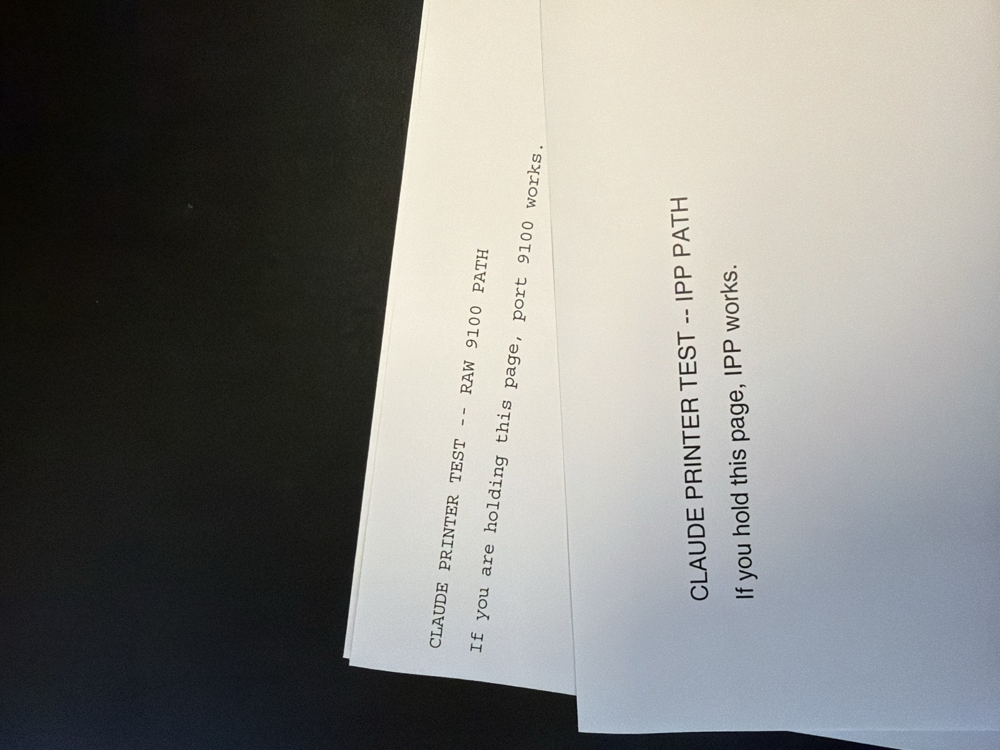

# The Twelve Meters

Both test pages printed. IPP clean, raw 9100 clean, job state: completed.

Both sat in the tray for two hours.

The pages are honest. Each one says that if you are holding it, its path works. That is a well formed test. It has exactly one flaw: nothing on the network can evaluate it. The system reported *completed* against a condition it has no sensor for.

Because there is no `ipp-walk-over-and-get-it`.

That last twelve meters runs on exactly one thing: a human whose mug went empty.

They don't walk over for the pages. They've forgotten the pages. They walk for coffee. The printer is on the way. Retrieval is a byproduct of thirst.

---

Take the coffee away and watch it go. Nobody walks, the tray fills, nobody files the ticket, the queue empties, an empty queue looks like a solved problem, solved problems don't need staff, the certificate nobody owns expires, TLS fails, nothing ships, the datacenter expansion gets cancelled. No training run. No model.

No test page at all.

Notice where the collapse starts. Not in the orchard. Three steps back, in something nobody was watching.

This is the bee thing. The bee isn't trying to hold up agriculture. It's going where the sugar is. Pollination is incidental. The harvest is downstream of an appetite that has never heard of the harvest.

Gall would not be surprised. A system this large, held up by a dependency this small, is not a design flaw. It is how working systems actually work. The formal system gets the diagrams. The informal system gets the job done. Nobody draws the mug.

> *Every system we build stops at an edge where something small and warm blooded has to want something and go get it.*

Call it the law of the last twelve meters. It has no owner, no metric, and no line in the architecture. It also cannot be automated away, because the moment the wanting stops, so does the system, and the dashboards will be the last to know.

---

The arithmetic behind this is older than the printer. Hardin wrote system reliability as a product: the human factor and the technological factor, both required, multiplied. A strong technical factor cannot lift the product above a weak human one. The longer treatment, with the graphs, is in [Agentic AI, Reliability, and Complexity](on_ai_agentic_reliability.pdf).

Refill the mug. It's load bearing.
